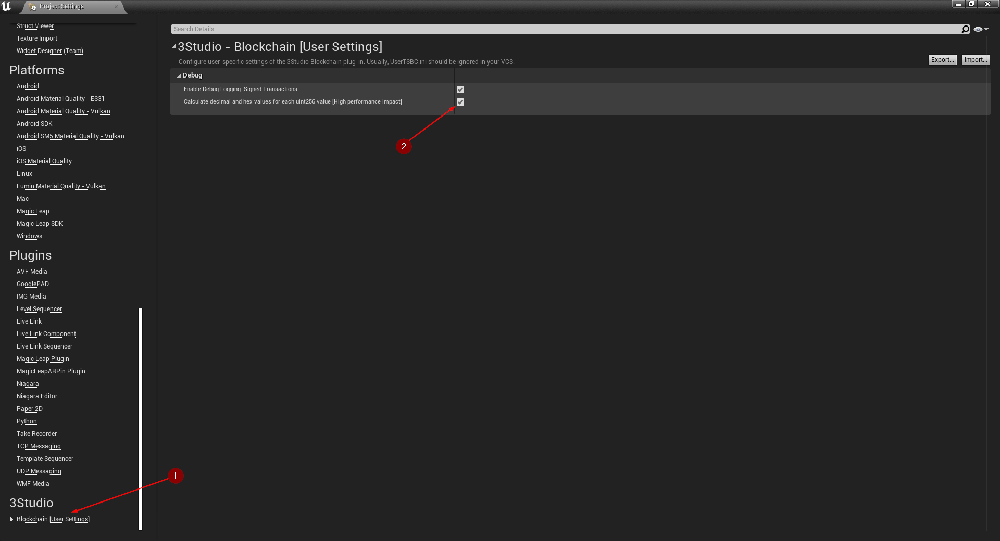
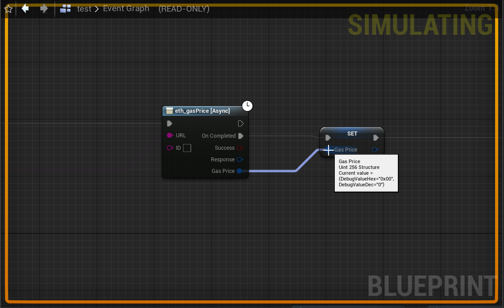
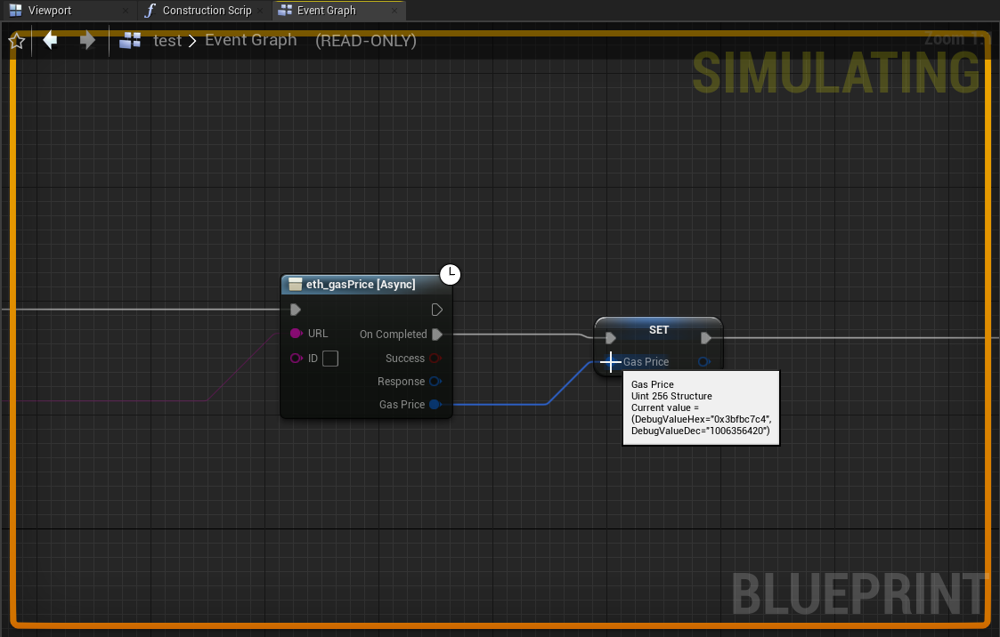

import {Step} from '@site/src/lib/utils.mdx'

## Debugging Transactions

Debug logging for signed transactions will help the developer to view all the important information when signing a
transaction that will be sent to the blockchain. You can enable the debugging by going to
`Edit | Project Settings | 3Studio | Blockchain [User Settings]` <Step text="1"/> and set true for
`Enable Debug Logging: Signed Transactions` <Step text="2"/>.

## Debugging Uint256

Debugging *uint256* can be enabled by going to `Edit | Project Settings | 3Studio | Blockchain [User Settings]` <Step text="1"/>
and set true for `Calculate decimal and hex values for each uint256 value [High performance impact]` <Step text="2"/>.
But as you can see in the hint above, when enabling the debugging for *uint256* it will have a high performance impact
in the editor when debugging in *Blueprints*.

### Disabled

In the image below you can see when you hover over the *uint256* variable while in debugging mode in *Blueprints* how the
values will appear as "0x00" in hex or "0" in decimal.

### Enabled

In the image below you can see when you hover over the *uint256* variable while in debugging mode in *Blueprints* you
will have the exact value that is saved in the variable.

