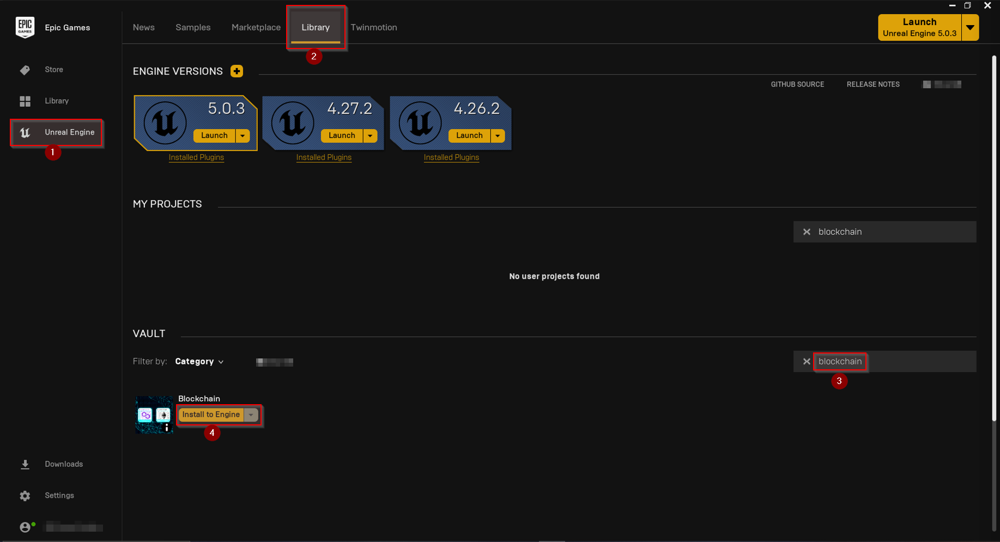

import {Step, Highlight} from '@site/src/lib/utils.mdx'

## Installation
here are two common ways to install Unreal Engine plugins:

  * Install the plugin globally as a so-called Engine Plugin simply by using the Epic Games Launcher.
  
  * Install the plugin as a so-called Project Plugin by copying the plugin files from the Unreal Engine's `Plugins` directory to your project's `Plugins` directory.

  Which one you would want to choose depends on your project needs. In general, it is preferable to install plugins directly to a project plugin 
  to prevent version and plugin update issues. However, the easiest way is to start with just installing a new plugin to Unreal Engine directly.

## Install as Engine Plugin

Open the Epic Games Launcher and select Unreal Engine <Step text="1"/> on the left side.

Next, select the Library <Step text="2"/> tab at the top and search for `Blockchain` in the VAULT section <Step text="3"/> to quickly find our plugins. 
Finally, click on the Install to Engine <Step text="4"/> button of the plugin you want to install to a specific Unreal Engine on your computer.

The newly installed plugin should now be available in all your projects that are using the same 
Unreal Engine version you chose to install the plugin to.

## Install as Project Plugin

First, you will need to install the plugin to the Unreal Engine as described in the previous section. 
After doing this, the plugin should now be available here (assuming Unreal Engine has been installed to the default location):

`C:\Program Files\Epic Games\UE_`<Highlight>`${VERSION}`</Highlight>`\Engine\Plugins\Marketplace`

where <Highlight>`${VERSION}`</Highlight> needs to be replaced with the Unreal Engine's version number you previously chose to install the plugin to:
`4.26`, `4.27`, `5.0`, etc.

Now, create a new directory called `Plugins` in your project's root directory and copy the plugin from the engine's directory into that newly created
`Plugins` directory.

