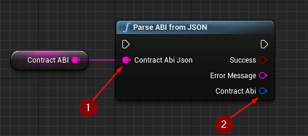
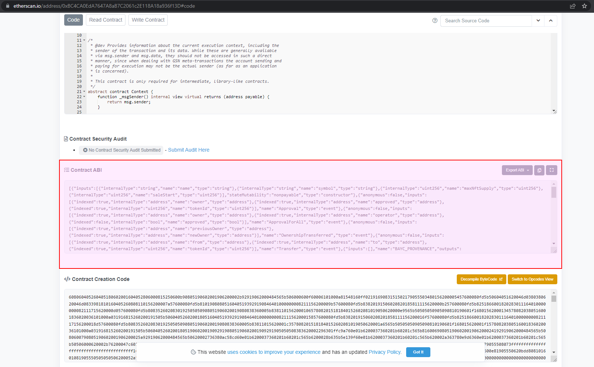

import {Step} from '@site/src/lib/utils.mdx'

## Contract ABI

To interact with a smart contract you need to be able to encode and decode the contract functions and their variables. To do so you must either 
store the contracts ABI or get it from [Ether Scan](https://etherscan.io/) for verified contracts. 
More on the subject [here](https://docs.soliditylang.org/en/develop/abi-spec.html).

## Parse ABI From JSON

`Parse ABI from JSON` Tries to parse an Ethereum Smart Contract ABI from the given JSON. This function requires input as follows:

* Contract ABI JSON <Step text="1"/> : The Ethereum Smart Contract ABI in JSON format to parse.

If the operation is successful, the value *Contract ABI* <Step text="2"/> will hold the function names with it's required arguments and it's return values.

Example of how the ABI looks like, this if from [Bored Apes Yacht Club](https://etherscan.io/address/0xBC4CA0EdA7647A8aB7C2061c2E118A18a936f13D#code) contract address.

:::note
It's recommended to store the value *Contract ABI*, since it will be used for encoding and decoding function arguments.
:::
