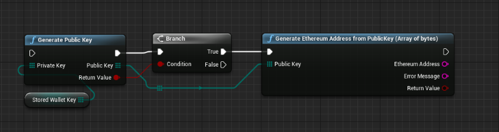
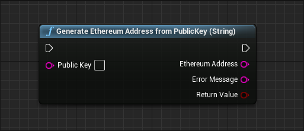
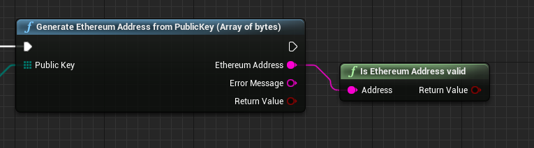

import {Step} from '@site/src/lib/utils.mdx'

## Wallet Address
Most generally, this represents an `External Owned Account`(EOA) or a *Contract* that can receive (destination address) or send (source address) transactions 
to the blockchain. More specifically, it is the rightmost 160 bits of a *Keccak* hash of an ECDSA *Public Key*.

## Generate Wallet Address

`Generate Ethereum Address From Public Key` function have 2 versions, where you can specify the *Public Key* either as an array of bytes or as a string.
For the most use cases you will be using the *Bytes Array* version due to nature of other nodes outputs and simplicity of it.

Also you can generate an *Address* from a *Public Key* provided to you as a string.

## Ethereum Address Checksum

*Ethereum address checksum validation* is a cryptographic function that allows users to verify their *Blockchain* addresses to ensure they are valid and don't contain any typos. Your *Ethereum* address well as every other Ethereum address in existence has two versions:
* One includes uppercase letters called *Checksummed*, example: `0x07d6A8689F7f869c1B878B0A753980eAadb9379e`
* The other version is called *Non-checksummed* address, example: `0x07d6a8689f7f869c1b878b0a753980eaadb9379e`

:::info
*Generate Ethereum Address From Public Key* always generates a *Checksummed* address.
:::

## Validate Wallet Address

To validate an *Ethereum* address simply use the pure function `Is Ethereum Address Valid`

