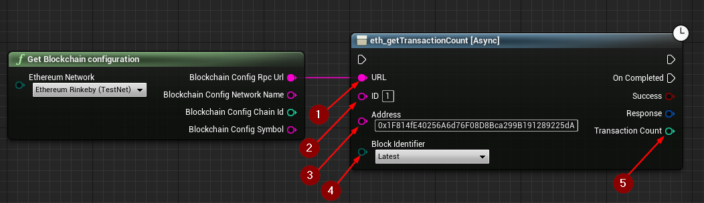

import {Step} from '@site/src/lib/utils.mdx'

## eth_getTransactionCount

`eth_getTransactionCount` Returns the number of transactions sent from an address. This function requires input as follows:

* URL <Step text="1"/> : RPC endpoint (Blockchain URL).
* ID <Step text="2"/> : RPC ID(Optional), used when calling multiple asynchronous RPC calls to differentiate your response data from each other.
* Address <Step text="3"/> : The address you want a transaction count from.
* Block Identifier(Optional) <Step text="4"/> : The block number to use which have multiple options:
    * `Earliest` for the earliest/genesis block.
    * `Latest` for the latest mined block.
    * `Pending` for the pending state/transactions.

The returned *Response* is a struct that holds the JSON- info of the header and body of the response as well as https status code.

:::note
If *Success* is *True* that only means that the response from the *Blockchain* was successful only.
:::

If successful, returns the *Transaction Count* <Step text="5"/> sent from an address as an integer.
