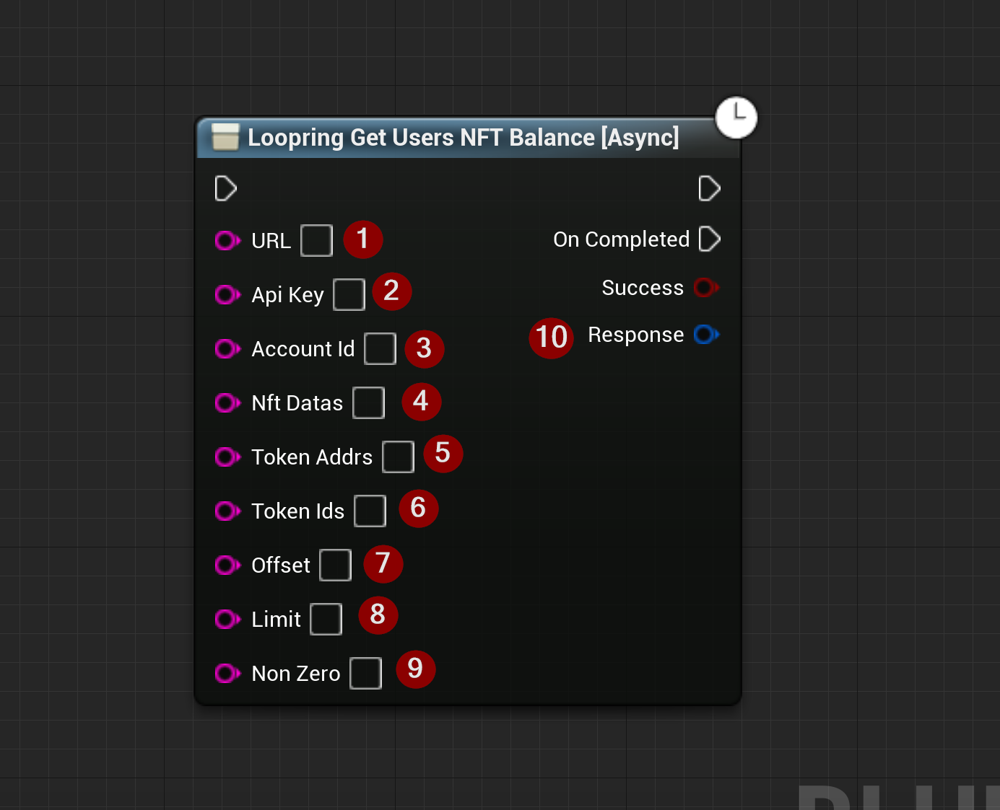

import {Step, Highlight} from '@site/src/lib/utils.mdx'

## Get users NFT balance
Sends a *REST-API* call to `Loopring` to get users NFT balance, besides amount, it also includes tokenId and nftData.
This function requires input as follows:

* URL <Step text="1"/> : The URL to send the request to.
* ApiKey <Step text="2"/> : API Key.
* AccountId <Step text="3"/> : Account ID.
* NftDatas <Step text="4"/> : The Loopring's NFT token data identifier which is a hash string of NFT token address and *NFT_ID*.
* TokenAddrs <Step text="5"/> : NFT token address.
* TokenIds <Step text="6"/> : The token slot ID in Loopring DEX.
* Offset <Step text="7"/> : Number of records to skip.
* Limit <Step text="8"/> : Number of records to return.
* NonZero <Step text="9"/> : Hide 0 balance NFT token, default is true.

The returned *Response* <Step text="10"/> is a struct that holds the response data for the HTTP request sent to `Loopring`.

:::note
If *Success* is *True* it only means that there was no error on the data transport layer (HTTP).
You also need to check the response body to determine the actual outcome of the call.
:::
