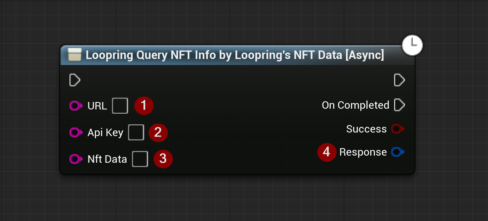

import {Step, Highlight} from '@site/src/lib/utils.mdx'

Sends a *REST-API* call to `Loopring` to query NFT info by `Loopring's` nftData. This function requires input as follows:

* URL <Step text="1"/> : The URL to send the request to.
* ApiKey <Step text="2"/> : API Key.
* NftData <Step text="3"/> : The Loopring's NFT token data identifier which is a hash string of NFT token address and *NFT_ID*.

The returned *Response* <Step text="4"/> is a struct that holds the response data for the HTTP request sent to `Loopring`.

:::note
If *Success* is *True* it only means that there was no error on the data transport layer (HTTP).
You also need to check the response body to determine the actual outcome of the call.
:::
