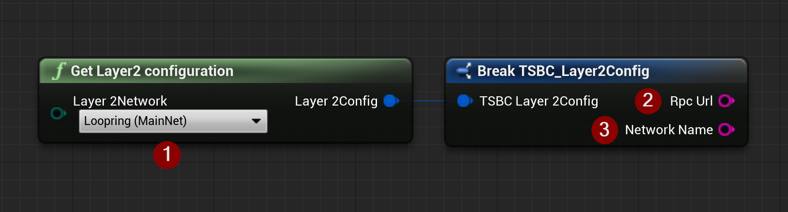

import {Step, Highlight} from '@site/src/lib/utils.mdx'

## Get Layer 2 Configuration

`Get Layer 2 Configuration` is a helper function that gets configuration data for a specific Layer 2 network needed
to send HTTP calls to <Step text="1"/>.

This function returns a *Struct* that contains:
* <Step text="2"/> Network's RPC URL endpoint.
* <Step text="3"/> Network's name.

Currently supported networks are:
* [Loopring](https://loopring.io/)
* [ImmutableX](https://www.immutable.com/)

