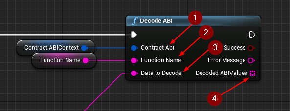

import {Step} from '@site/src/lib/utils.mdx'

## Decode ABI

`Decode ABI` Decodes the resulting data returned from an *Ethereum* RPC-call. This function requires input as follows:

* Contract ABI Struct <Step text="1"/> : The parsed object generated from `Parse ABI From JSON`.
* Function Name <Step text="2"/> : The function name that was used to call the *Ethereum Smart Contract* function which returned the data that should now be decoded here.
* Data to Decode <Step text="3"/> : Data to decode.

If the operation is successful, the value *Decoded ABI Values* <Step text="4"/> will hold the decoded data returned from an *Ethereum* RPC-call.
