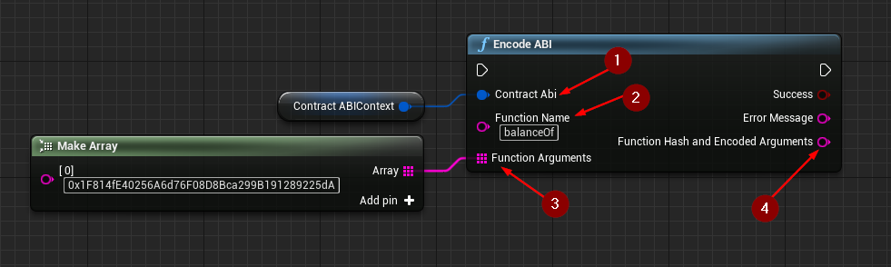

import {Step} from '@site/src/lib/utils.mdx'

## Encode ABI

`Encode ABI` Generates a *Function Selector* with argument encoding for a specific function of an *Ethereum Smart Contract*. This function requires input as follows:

* Contract ABI Struct <Step text="1"/> : The parsed object generated from `Parse ABI From JSON`.
* Function Name <Step text="2"/> : The function name to hash.
* Function Arguments <Step text="3"/> : Function arguments to encode.

:::info
You should know the function's name and it's arguments in order to successfully encode the data.
:::

If the operation is successful, the value *Function Hash And Encoded Arguments* <Step text="2"/> will hold the encoded data required to call the function on the *Smart Contract* using `eth_call` function.
