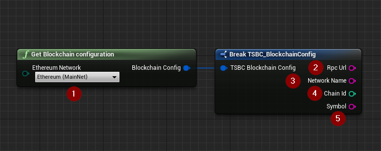
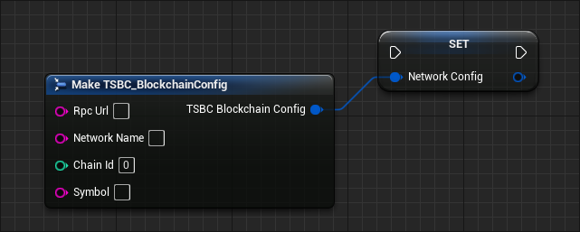

import {Step} from '@site/src/lib/utils.mdx'

## Get Blockchain Configuration

`Get Blockchain Configuration` is a helper function that holds default information for commonly used `Ethereum` networks <Step text="1"/>. 

This function returns a *Struct* that contains:
* <Step text="2"/> Network's RPC URL endpoint
* <Step text="3"/> Network's name
* <Step text="4"/> Network's Chain ID
* <Step text="5"/> Network's Symbol. 

We didn't provide a block explorer link as it is unlikely to be used in a final product.

Currently supported networks are:

* Main Nets:
  * Ethereum
  * Polygon
  * Avalanche
  * Binance Smart Chain
  * Cronos
  * Huobi Eco Chain

* Test Nets:
  * Ropsten
  * Rinkeby
  * Goerli
  * Sepolia
  * Avalanche FUJI C-Chain
  * Binance Smart Chain
  * Cronos
  * Huobi Eco Chain

## Custom Blockchain Configuration

By creating a struct inherited from `TSBC_BlockchainConfig` you are able to store any other network configuration for later use.
You can also use local `Blockchains` like `Ganache`, or private end points such as `Infura` to access public and private `Blockchains`.

