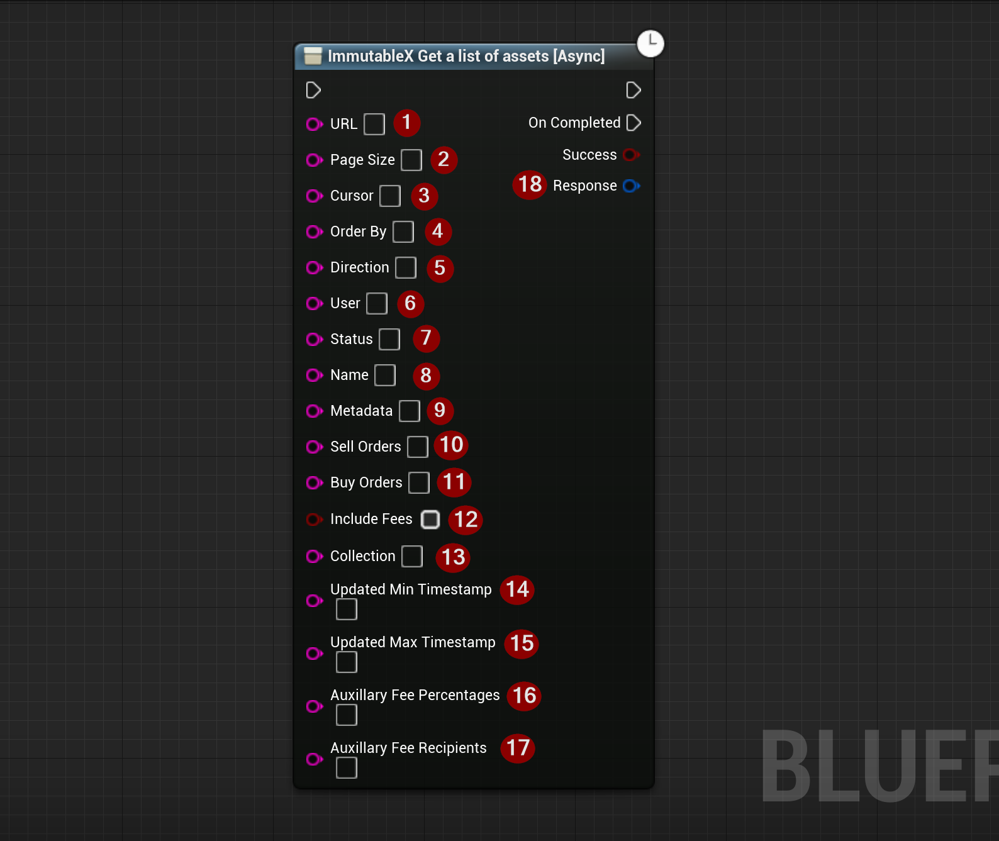

import {Step, Highlight} from '@site/src/lib/utils.mdx'

Sends a *REST-API* call to `ImmutableX` to get a list of assets. This function requires input as follows:

* URL <Step text="1"/> : The URL to send the request to.
* PageSize <Step text="2"/> : Page size of the result.
* Cursor <Step text="3"/> : Cursor.
* OrderBy <Step text="4"/> : Property to sort by.
* Direction <Step text="5"/> : Direction to sort (asc/desc).
* User <Step text="6"/> : Ethereum address of the user who owns these assets.
* Status <Step text="7"/> : Status of these assets.
* Name <Step text="8"/> : Name of the asset to search.
* Metadata <Step text="9"/> : URL JSON-encoded metadata filters for these assets.
* SellOrders <Step text="10"/> : Set flag to true to fetch an array of sell order details with accepted status associated with the asset.
* BuyOrders <Step text="11"/> : Set flag to true to fetch an array of buy order details  with accepted status associated with the asset.
* IncludeFees <Step text="12"/> : Set flag to include fees associated with the asset.
* Collection <Step text="13"/> : Collection contract address.
* UpdatedMinTimestamp <Step text="14"/> : Minimum timestamp for when these assets were last updated, in ISO 8601 UTC format.
* UpdatedMaxTimestamp <Step text="15"/> : Maximum timestamp for when these assets were last updated, in ISO 8601 UTC format.
* AuxiliaryFeePercentages <Step text="16"/> : Comma separated string of fee percentages that are to be paired with auxiliary_fee_recipients.
* AuxiliaryFeeRecipients <Step text="17"/> : Comma separated string of fee recipients that are to be paired with auxiliary_fee_percentages.

The returned *Response* <Step text="18"/> is a struct that holds the response data for the HTTP request sent to `ImmutableX`.

:::note
If *Success* is *True* it only means that there was no error on the data transport layer (HTTP).
You also need to check the response body to determine the actual outcome of the call.
:::
