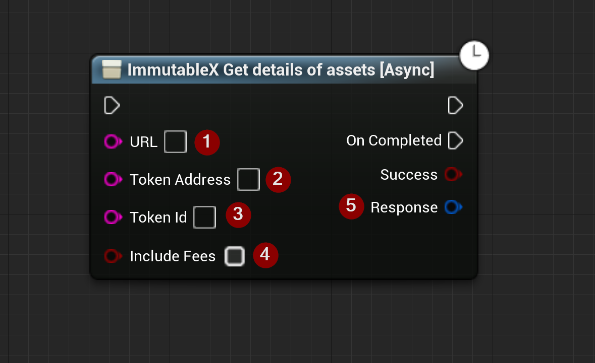

import {Step, Highlight} from '@site/src/lib/utils.mdx'

Sends a *REST-API* call to `ImmutableX` to get details of an asset. This function requires input as follows:

* URL <Step text="1"/> : The URL to send the request to.
* TokenAddress <Step text="2"/> : `Required` Address of the ERC721 contract.
* TokenId <Step text="3"/> : `Required` Either ERC721 token ID or internal IMX ID.
* IncludeFees <Step text="4"/> : Set flag to include fees associated with the asset.

The returned *Response* <Step text="5"/> is a struct that holds the response data for the HTTP request sent to `ImmutableX`.

:::note
If *Success* is *True* it only means that there was no error on the data transport layer (HTTP).
You also need to check the response body to determine the actual outcome of the call.
:::
