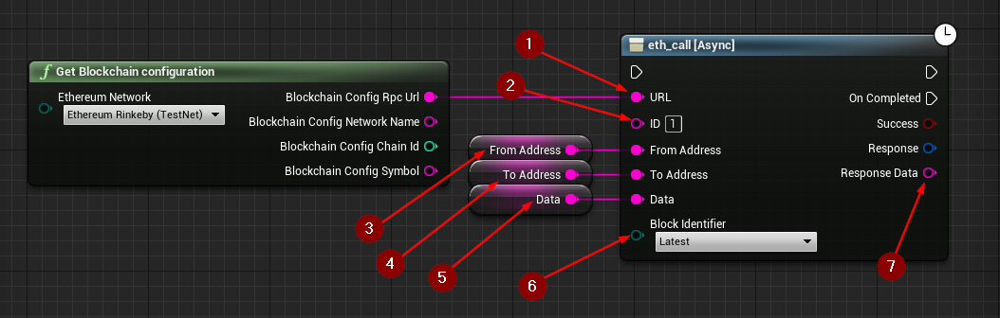

import {Step} from '@site/src/lib/utils.mdx'

## eth_call

`eth_call` Executes a new message call immediately without creating a transaction on the block chain. This function requires input as follows:

* URL <Step text="1"/> : RPC endpoint (Blockchain URL).
* ID <Step text="2"/> : RPC ID(Optional), used when calling multiple asynchronous RPC calls to differentiate your response data from each other.
* From Address <Step text="3"/> : The address the transaction is sent from.
* To Address <Step text="4"/> : The address the transaction is directed to.
* Data <Step text="5"/> : The hash of the invoked method signature and encoded parameters (ABI).
* Block Identifier(Optional) <Step text="6"/> : The block number to use which have multiple options:
    * `Earliest` for the earliest/genesis block.
    * `Latest` for the latest mined block.
    * `Pending` for the pending state/transactions.

The returned *Response* is a struct that holds the JSON- info of the header and body of the response as well as https status code.

:::note
If *Success* is *True* that only means that the response from the *Blockchain* was successful only.
:::

If successful, returns the *Response Data* <Step text="7"/> which is the value of executed contract.