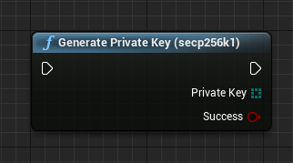
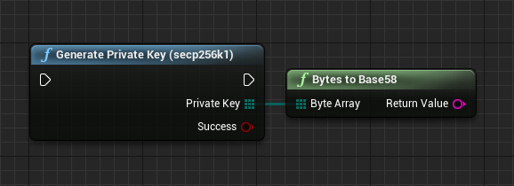
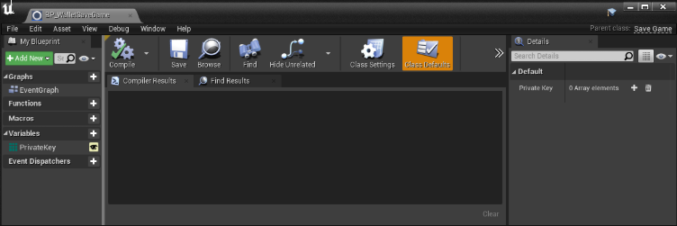
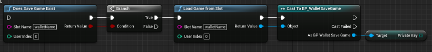
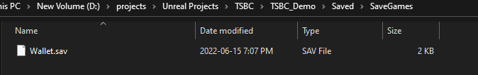
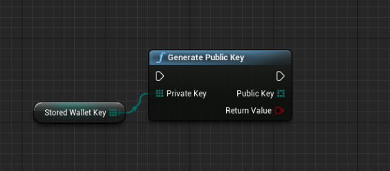

import {Step} from '@site/src/lib/utils.mdx'

## Private Key

`Private Key` is a secret number that allows *Ethereum* users to prove ownership of an account or contracts, by producing a digital signature.

### Generate Random Key
`Generate Private Key` is a function that allows you to generate a *Private Key* easily.
There is a slight chance of failure on untested platforms, but in general the plugin should work on all platforms.

We strongly recommend using this function for *Private Key* generation since it's using a high secure random byte function.

### Bytes To Base58
`BytesToBase58` is a helper function that converts a *Bytes Array* into a *Base58 String*.
This helps to display the key in an easy to read format(String) or for offline storaging.

### Storing Keys

To truly own crypto assets you must be in possession of your *Private Keys* to access your assets.
Meaning the private key generated should not be stored on a server, but is owned by the user. All transactions should be initiated directly from the user's endpoint and directed to the *Blockchain* network and not to an intermediary server.

The easiest way to store *Private keys* is to make a new `Save Game` object, create a variable of "Bytes Array" type in it then store the private key in it directly.

To store the values you can use functions `Create Save Game Object`, and `Save Game to Slot`. You can find more info about saving game objects [here](https://docs.unrealengine.com/4.27/en-US/InteractiveExperiences/SaveGame/).

In this way the *Private key* will be stored locally on the users's device which will allow to reuse it again when the game is running.
To load a *Private Key* you just need to verify that the save game file exists, then load it from the device. After that you have to either cast your save game object to your custom save game or use a blueprint interface to read the value.

Your save game objects are stored in editor as well in your `projects-folder/Saved/SaveGames`.

Only the *Private Key* is necessary to gain full access to your wallet. All other components like an *Address* or *Public Key* can be regenerated from *Private Key* at any time.
It is good practice to lock all functionalities of *Blockchain* in an object that exists only on local client - like Widgets, HUD, Game Instance. 

:::warning
Never replicate *Private Keys* to server or to other clients.
:::

## Public Key

`Public Key` is a number derived via a one-way function from a *Private key*, which can be shared publicly and used by anyone to verify a digital signature made with the corresponding *Private Key*.

You can easily generate a *Public Key* by using the function `Generate Public Key`

