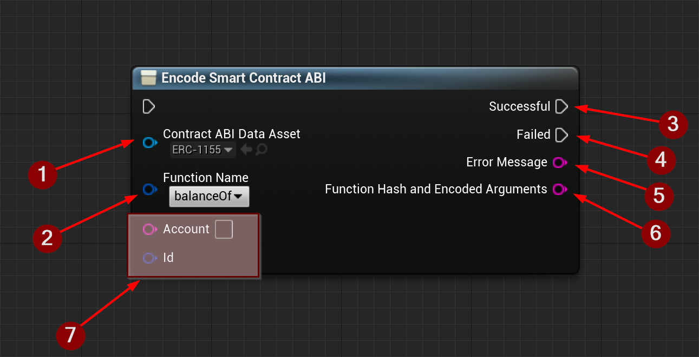
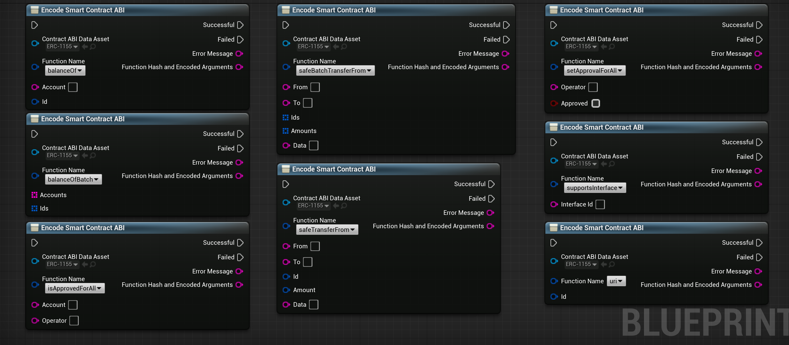

import {Step} from '@site/src/lib/utils.mdx'

The `Encode Smart Contract ABI` node generates a *Function Selector* with argument encoding for a specific function of an *Ethereum Smart Contract*.

* Contract ABI Data Asset <Step text="1"/> : Data asset that holds parsed data for the *Smart Contract ABI*.
* Function Name <Step text="2"/> : The function name to hash.
* Successful <Step text="3"/> : Executes when encoding was successful.
* Failed <Step text="4"/> : Executes when encoding failed.
* Error Message <Step text="5"/> : Contains an error message in case the operation failed. Otherwise, it will be empty.
* Function Hash And Encoded Arguments <Step text="6"/> : The *Function Selector* with encoded arguments.
* Function Arguments <Step text="7"/> : `Argument pins` will be generated dynamically depending on the selected function.

:::info
If the operation was successful, the output variable *Function Hash And Encoded Arguments* <Step text="6"/> will hold the
encoded data required to call the function on the *Smart Contract* using the [`eth_call` function](/docs/ethereum/ethereum-functions/eth-call).
:::

## Examples

Here is an example of how this node will look like when selecting different smart contract functions.
The *argument pins* are dynamically generated according to the selected function's signature. This means that
the number of *argument pins* and their respective names and data types will be correctly reflected.

:::warning Limitations
Due to limitations in *Blueprints* adding nested arrays to this node was not possible, so a *Smart Contract* function
with a `TupleArray` argument type can't be encoded, and a *Smart Contract* function with 1 `Tuple` plus any other
type, can't be encoded also.
:::
