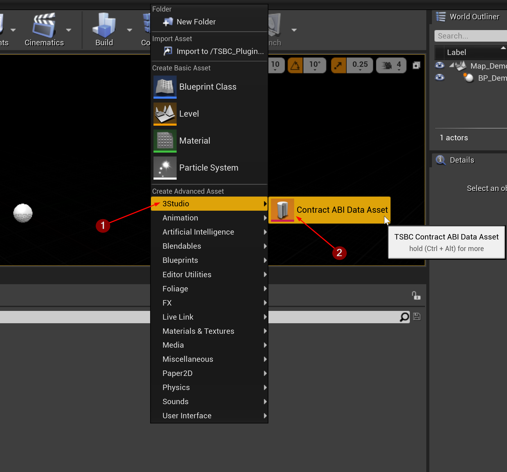
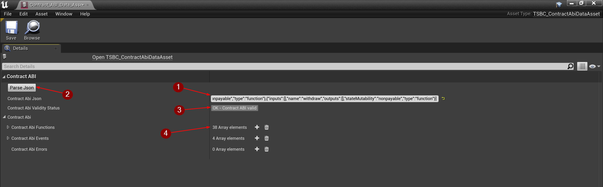

import {Step} from '@site/src/lib/utils.mdx'

## Smart Contract ABI

To interact with a smart contract you need to be able to encode and decode the contract functions and their variables. To do so you must either 
store the contract's ABI or get it from [Ether Scan](https://etherscan.io/) for verified contracts.
More on the subject [here](https://docs.soliditylang.org/en/develop/abi-spec.html).

## Create Contract ABI Data Asset

To create a *Contract ABI* data asset, right-click in the *Content Browser* and
select `3Studio` <Step text="1"/> then `Contract ABI Data Asset` <Step text="2"/>.

:::info
For this example we will copy the *Smart Contract ABI* from [Bored Apes Yacht Club](https://etherscan.io/address/0xBC4CA0EdA7647A8aB7C2061c2E118A18a936f13D#code) contract address.
:::

## Configure Contract ABI Data Asset

Open the *Contract ABI* data asset. It will hold data as follows:

* `Contract Abi Json`: Paste the copied *Smart Contract ABI* JSON string into this field. <Step text="1"/>
* `Parse Json`: Tries to parse the *Smart Contract ABI* from the given JSON. <Step text="2"/>
* `Contract Abi Validity Status`: Displays the status of parsing the *Smart Contract ABI* JSON data. <Step text="3"/>
* `Contract Abi Functions`: List of data needed from the *Smart Contract ABI* which will be used later for encoding and decoding. <Step text="4"/>

:::caution Potential pitfall
Whenever you make changes to the JSON in `Contract Abi Json` <Step text="1"/>, don't forget to also click the `Parse Json` <Step text="2"/> button.
:::
