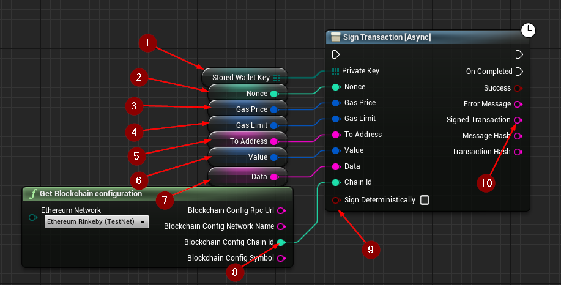
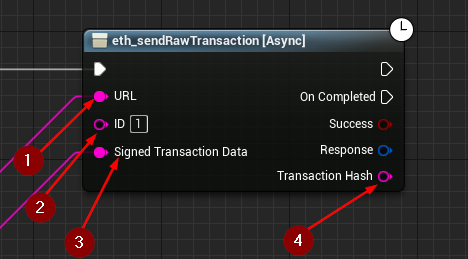

import {Step} from '@site/src/lib/utils.mdx'

## Signing A Transaction

`Sign Transaction` Signs a transaction that can be submitted to the network at a later time using with `eth_sendRawTransaction` as long as the nonce and the 
signature are correct. 
This function requires input as follows:

* Private Key <Step text="1"/> : The *Private key* to use for signing the transaction.
* Nonce <Step text="2"/> : Must be equal to the transaction count (the returned value from `eth_getTransactionCount`).
* Gas Price <Step text="3"/> : The gas price used for each paid gas, in Wei(the returned value from `eth_gasPrice`).
* Gas Limit <Step text="4"/> : Gas limit provided for the transaction to execute.(A standard transfer of funds will have a static gas limit of 21000 WEI).
* To Address <Step text="5"/> : The address the transaction is directed to.
* Value <Step text="6"/> : The amount of Ether (in Wei) to send with this transaction.
* Data <Step text="7"/> : The hash of the invoked method signature and encoded parameters (ABI).
* Chain ID <Step text="8"/> : The Blockchain ID.
* SignDeterministically <Step text="9"/> : If true, the transaction will be signed deterministically which means the same inputs result in the same output. Otherwise, the output will be randomized even for the same inputs.

If the operation is successful, the value *Signed Transaction* <Step text="10"/> will hold the encoded and signed transaction data that can be passed to `eth_sendRawTransaction`.

## eth_sendRawTransaction

`eth_sendRawTransaction` Creates new message call transaction or a contract creation for signed transactions (can be simple value transfers, contract creation, or contract invocation).
This function requires input as follows:

* URL <Step text="1"/>: RPC endpoint (Blockchain URL).
* ID <Step text="2"/>: RPC ID(Optional), used when calling multiple asynchronous RPC calls to differentiate your response data from each other.
* Signed Transaction Data <Step text="3"/>: The encoded and signed transaction data.

The returned *Response* is a struct that holds the JSON- info of the header and body of the response as well as https status code.

:::note
If *Success* is *True* that only means that the response from the *Blockchain* was successful only.
:::

If successful, returns the *Transaction Hash* <Step text="4"/>, or the zero hash if the transaction is not yet available.
