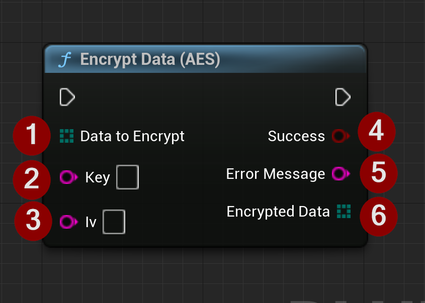

import {Step, Highlight} from '@site/src/lib/utils.mdx'

`Encrypt Data (AES)` function encrypts data using the AES-256 CBC algorithm.
This function is intended to be used to encrypt small amounts of sensitive data such as private keys.

This function requires the following inputs:
* <Step text="1"/> The data to be encrypted.
* <Step text="2"/> The key used to encrypt the data.
* <Step text="3"/> The initial vector used with the key to encrypt the data.

The function returns the following:
* <Step text="4"/> A boolean value indicating whether the encryption was successful or not.
* <Step text="5"/> An error message if encryption fails.
* <Step text="6"/> The encrypted data.

:::warning
This function is specifically designed to encrypt private keys and is not suitable for encrypting large amounts of data.
:::

