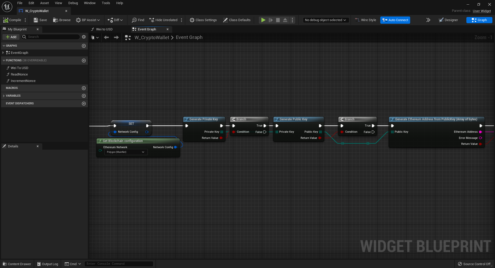

import {Step} from '@site/src/lib/utils.mdx'

## Contract ABI

To interact with a smart contract you need to be able to encode and decode the contract functions and their variables. To do so you must either 
store the contracts ABI or get it from ether scan for verified contracts. More on the subject [here](https://docs.soliditylang.org/en/develop/abi-spec.html).

To generate a contract ABI object use function "parse ABI from JSON. 
You can copy this JSON from ether scan or other scanner with contract verification page.

Template Image

Example of ABI from Bored Apes Yacht Club contract address 0xBC4CA0EdA7647A8aB7C2061c2E118A18a936f13D

Template Image

If your game revolves around a single or few contracts its good practice to store the ABI object as varaible for future use as it's used for both encoding 
and deciding values.

## Encode ABI

To use ABI functions you need to know their name and parameters types. As an example we are trying to encode "balanceOf" for the example 
contract and our own wallet address. We could as well query any other wallet address with this function.

Template Image

Our example of encoded function would look like this. Now because it's a get function that doesn't require to be "payable" and is free to execute,
we are pushing it with "Eth Call"

### Eth_Call
This function is specifically designed to call any "read contract" functions. Previously encoded ABI function with parameters can be now pushed here. 
We must specify to what network we are doing the call. The contract must exist in this network. 
You can switch wallets fluently and can query NFTs on multiple networks. As well as have funds in a wallet on multiple networks.

Template Image

"To address" is the contract address. From address is "our" address. id is optional to identify multiple parallel requests returns. 
Block identifier set to "latest" is safest as it takes account of only confirmed transactions and current state of the blockchain.

## Decode ABI
This function takes input of the previously established ABI object, function name a data to decode. with this you can decode the data as direct variables 
you asked the function of. In our case we were asking for "balanceOf" for a single address, meaning we will get a return of integer as string. 

Template Image

## NFT in general

Usual workflow with ntf's is as follows.. we get "balanceOf" for a wallet. if balance is above 0 we know how many NFTs the user have. 
now we must know the NFTs IDs.. to do that we call "tokenByOwnerByIndex" in our case. it other cases the function would be called differently. 
it gives you mapping of owners and their tokens, or tokens id array. No matter how you got it  -you should end up with an array of tokens 
ID for particular owner. Now you can call "tokenURI" to receive the metadata URL containing the tokens metadata. Is some cases the token 
itself will contain the metadata. TokenURI usually gives a link to direct JSON where from you can parse the data directly with one of many 
JSON parsing plugin available in Unreal Engine. 

