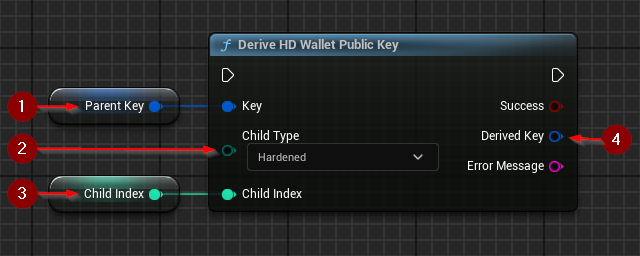

import {Step} from '@site/src/lib/utils.mdx'

Child public keys be derived from both private and public keys. The child can be *hardened* if the parent is private.
Attempting to create a *hardened* child using a public key will result in an error. *Non-hardened* keys are still useful,
but need to be handled carefully to avoid security risks.
For more information about the concept of a *hardened* child read [BIP-32](https://github.com/bitcoin/bips/blob/master/bip-0032.mediawiki#implications).

## Deriving a Child Public Key

`Derive HD Wallet Private Key` uses an extended private key to create a child key with specified parameters.
This function requires inputs as follows:

* Key <Step text="1"/> : The key used in the derivation process. Invalid and public (if the child is *hardened*) keys will cause the operation to fail.
* Child Type <Step text="2"/> : Type of child to create. This allows for the child key to be *hardened* if needed.
* Child Index <Step text="3"/> : The number of the child. It is an index between 0 and 231-1.
*Hardened* child keys will have their index shifted by 231 when serialized to match BIP-32 specification.

If the operation is successful, the value *Derived Key* <Step text="4"/> will hold the generated valid child public key.