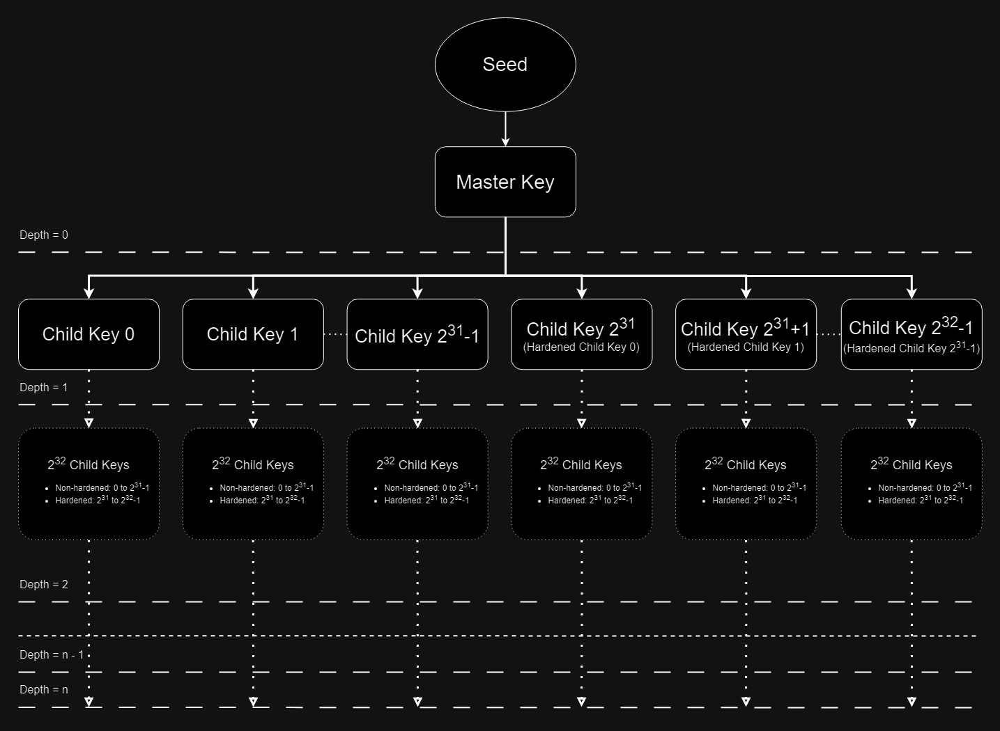

import {Step} from '@site/src/lib/utils.mdx'

HD Wallets are defined in [BIP-32](https://github.com/bitcoin/bips/blob/master/bip-0032.mediawiki#serialization-format).

Hierarchical Deterministic Wallets, or *HD Wallets*, introduce cryptocurrency wallet technology that allows for the creation
of a tree-like structure of wallet keys, with the maximum depth of 256. A single seed, usually created using mnemonic sentences
([BIP-39](https://github.com/bitcoin/bips/blob/master/bip-0039.mediawiki)) that allow for easier memorization, is used to
generate the master keypair. From it, 232 direct child key pairs (231 *hardened* and 231 *non-hardened*)
can be derived and every node in hierarchy can derive the same amount of its own children.  The entire wallet structure
is recoverable from the seed, or master key. Wallet sub-structures can also be recovered from parent key data, without
knowing the master key data or seed at all.

*Diagram of an HD Wallet*

## Why HD Wallets?

### Security

As long as the master seed and key is kept secret, only the branch of the structure that has its private key leaked is exposed.
This is in reduces risk of exposure of specific, important keys compared to managing multiple standalone keys.

### Recovery

Having the master seed, or the key that is the parent of the current branch allows for backup and easy recovery of any child key derived from it.
This makes backup and recovery much easier than storing multiple standalone keys.

### Privacy

A new address generated for every transaction makes tracing transactions more difficult which in turn enhances privacy of the wallet.

### Compatibility

HD Wallets are supported widely by various cryptocurrency wallets. It is easier to switch wallets or use the same wallet key structure
on multiple wallets.

### Multi-Currency Support

Multiple cryptocurrencies can be managed by a single wallet. This allows for less separate wallets used for each asset.

### User Experience

Managing multiple keys is difficult and without careful management may result in key and asset loss. Using HD Wallets removes
most of that risk, because the complexity of key management is abstracted away. Only master seed or key is needed to access wallet assets.

## Child Types

Child keys can be either *hardened* or *non-hardened*. The concept of *hardened* keys allows for greater control over
security and infrastructure of the Wallet. Every key has 231 *hardened* and 231 *non-hardened* children.
*Hardened* children can only be derived using the parent private key, while *non-hardened* public keys can be derived using the parent public key.

## Key Structure

This plugin adapts the key elements into blueprint-friendly types encapsulated in a structure.

### Members

#### Key Type

The type of the key, either `Public` or `Private`. Invalid keys may be set to `None`.

#### Version

Version of the key. Specifies the type of blockchain the wallet is used on. This affects the key serialization.

#### Depth

Depth of the key. In the wallet tree-like structure, specifies the number of parent nodes including the master key.

#### Parent Fingerprint

The first 4 bytes of the parent key identifier (Hash160 of the public key data).

#### Child Type

The type of child this key is, either *hardened* or *non-hardened*. This is then used to adjust the child number for the purposes of BIP-32.
Master key is always non-hardened (because the default child number for master key is 0).

#### Child Number

The index of the child key this key represents. A number between 0 and 231-1.

#### Chain Code

Additional 32 bytes of data used in key derivation. The initial chain code is generated from entropy obtained from a
Cryptographically Secure Pseudo Random Number Generator (CSPRNG).

#### Key Data

The data of the cryptographic key this HD Wallet extended key represents.

### Creating a Key Structure from Members

`Make HD Wallet Key` creates a new HD Wallet Key structure from direct data.
This function requires inputs as follows:

* [Key Type](#key-type) <Step text="1"/>.
* [Version](#version) <Step text="2"/>.
* [Depth](#depth) <Step text="3"/>.
* [Parent Fingerprint](#parent-fingerprint) <Step text="4"/>.
* [Child Type](#child-type) <Step text="5"/>.
* [Child Number](#child-number) <Step text="6"/>.
* [Chain Code](#chain-code) <Step text="7"/>.
* [Key Data](#key-data) <Step text="8"/>.

The result key structure is held within the value *Key* <Step text="9"/>.

### Accessing Key Structure Members

`Break HD Wallet Key` extracts direct key data from a key structure.
This function requires inputs as follows:

* Key <Step text="1"/> : The key which is to be accessed.

The output values are:

* [Key Type](#key-type) <Step text="2"/>.
* [Version](#version) <Step text="3"/>.
* [Depth](#depth) <Step text="4"/>.
* [Parent Fingerprint](#parent-fingerprint) <Step text="5"/>.
* [Child Type](#child-type) <Step text="6"/>.
* [Child Number](#child-number) <Step text="7"/>.
* [Chain Code](#chain-code) <Step text="8"/>.
* [Key Data](#key-data) <Step text="9"/>.