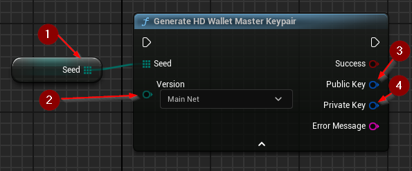

import {Step} from '@site/src/lib/utils.mdx'

## Generating the Master Keypair

`Generate HD Wallet Master Keypair` generates a new public and private extended master keys (child number 0). These keys
can be used to derive child extended keys and create an inheritance structure.
This function requires inputs as follows:

* Seed <Step text="1"/> : The seed used in master key generation. Usually created using a mnemonic sentence converted into a seed.
* Version <Step text="2"/> : The version of the generated key. The type of blockchain the key is associated with. Generated keys work only in matching blockchains.

If the operation is successful, the values *Public Key* <Step text="3"/> and *Private Key* <Step text="4"/> will hold the generated valid master keypair.
These keys can then be used for child key derivation.
