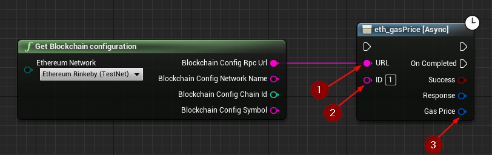

import {Step} from '@site/src/lib/utils.mdx'

## eth_gasPrice

`eth_gasPrice` Returns the current gas price on the network in wei. This function requires input as follows:

* URL <Step text="1"/> : RPC endpoint (Blockchain URL).
* ID <Step text="2"/> : RPC ID(Optional), used when calling multiple asynchronous RPC calls to differentiate your response data from each other.

The returned *Response* is a struct that holds the JSON- info of the header and body of the response as well as https status code.

:::note
If *Success* is *True* that only means that the response from the *Blockchain* was successful only.
:::

If successful, returns the current *Gas Price* <Step text="3"/> on the network in wei.