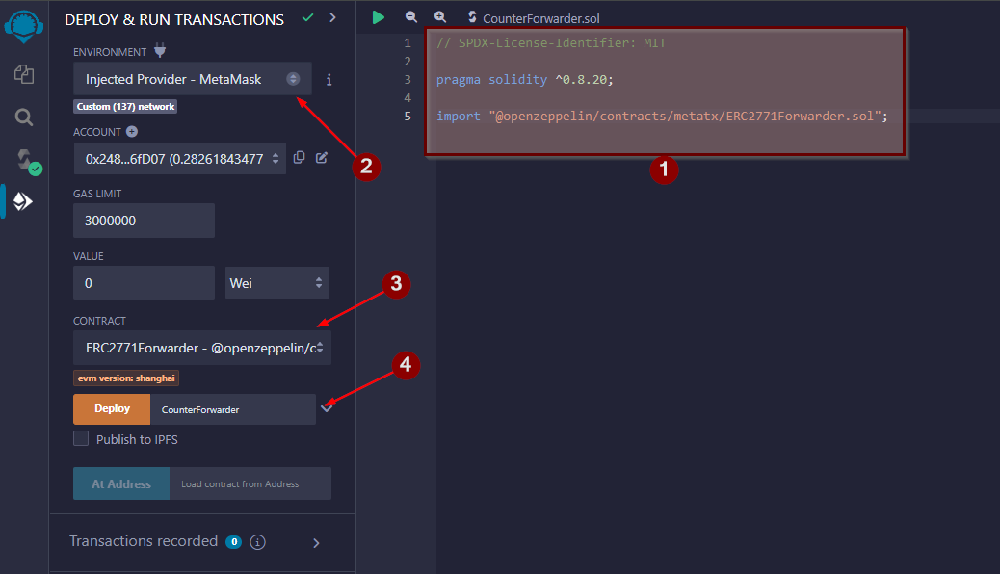

import {Step, Highlight} from '@site/src/lib/utils.mdx'

# Prepare the Forwarder Contract

We will be using [Remix](https://remix.ethereum.org/) web IDE to compile and deploy Smart Contracts to the Blockchain,
and a production-ready Forwarder from
[OpenZeppelin](https://github.com/OpenZeppelin/openzeppelin-contracts/blob/master/contracts/metatx/ERC2771Forwarder.sol)
that relays operation requests signed off-chain by an EOA (Externally Owned Account).

## Remix IDE

* Create a new file in Remix and name it `CounterForwarder`.

* Paste this code in the file as shown in the image below <Step text="1"/>.
``` Solidity
// SPDX-License-Identifier: MIT

pragma solidity ^0.8.20;

import "@openzeppelin/contracts/metatx/ERC2771Forwarder.sol";
```

* Then compile the file using compiler version 0.8.20+. After that you go to *DEPLOY & RUN TRANSACTIONS* tab and select
from the `Environment` drop down *Injected Provider - MetaMask* <Step text="2"/>.

* Make sure the correct contract is selected in the `Contract` drop down which is `ERC2771Forwarder` <Step text="3"/>.

* Lastly you need to provide a *Forwarder Name* for the `ERC2771Forwarder` constructor in order to deploy this contract.
Let's set it to `CounterForwarder` as seen in the image below <Step text="4"/>.




