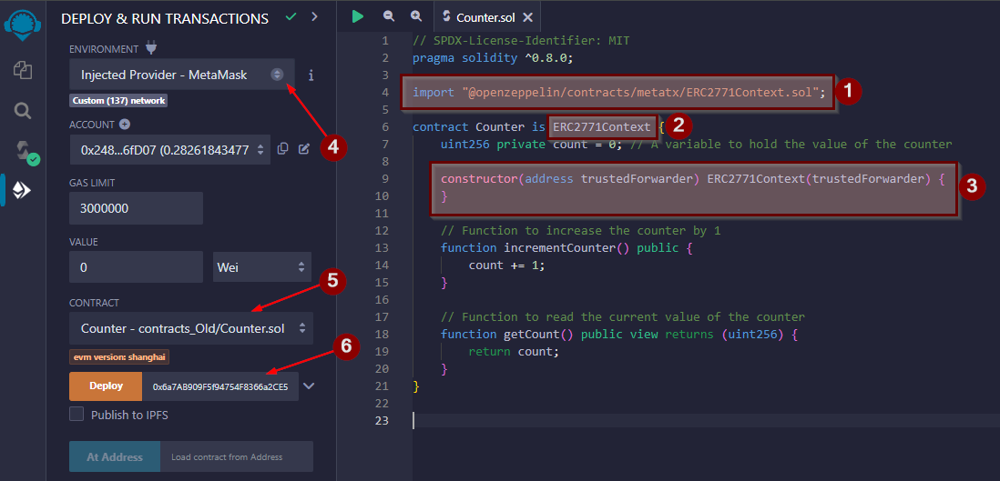

import {Step, Highlight} from '@site/src/lib/utils.mdx'

# Preparing the Recipient Contract

We will be using [Remix](https://remix.ethereum.org/) web IDE to compile and deploy smart contracts to the Blockchain.

We need to add to our own contract [ERC2771Context](https://github.com/OpenZeppelin/openzeppelin-contracts/blob/master/contracts/metatx/ERC2771Context.sol)
that provides a mechanism to override the sender and calldata of the execution context (msg.sender and msg.data)
with a custom value specified by a trusted forwarder.

# Remix IDE

* Create a new file in Remix and name it `Counter`.

* For the demo purposes we will be using this simple counter contract.
``` Solidity
// SPDX-License-Identifier: MIT
pragma solidity ^0.8.0;

import "@openzeppelin/contracts/metatx/ERC2771Context.sol";

contract Counter is ERC2771Context {
    uint256 private count = 0; // A variable to hold the value of the counter

    constructor(address trustedForwarder) ERC2771Context(trustedForwarder) {
    }

    // Function to increase the counter by 1
    function incrementCounter() public {
        count += 1;
    }

    // Function to read the current value of the counter
    function getCount() public view returns (uint256) {
        return count;
    }
}
```

* As shown in the code snippet, we imported `ERC2771Context.sol` from OpenZeppelin <Step text="1"/>.

* This contract inherits from `ERC2771Context` <Step text="2"/>.

* We added a constructor for the contract that passes the trusted forwarder to the constructor of `ERC2771Context` <Step text="3"/>.

* Then compile the file using compiler version 0.8.20+. After that you go to *DEPLOY & RUN TRANSACTIONS* tab and select
from the `Environment` drop down *Injected Provider - MetaMask* <Step text="4"/>.

* Make sure the correct contract is selected in the `Contract` drop down which is `Counter` <Step text="5"/>.

* Lastly you need to provide the *Trusted Forwarder Address* that we deployed earlier to the `Counter` constructor in
order to deploy this contract <Step text="6"/>.



