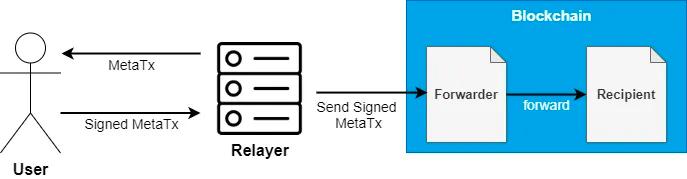

import {Step, Highlight} from '@site/src/lib/utils.mdx'

## What are Meta Transactions

Meta transactions are a popular way to enable users to make a transaction on blockchain without directly paying the gas fees.
Instead, they sign a message off-chain, which is then sent to a relayer who pays the gas fees and executes the transaction process.

# How Meta Transactions Work

`User`: signs a meta transaction (that is a message containing information about the transaction he would like to execute).

`Relayer`: a web server with a wallet that signs a valid Ethereum transaction (that has the meta transaction as the payload) and sends it to the blockchain.

`Forwarder`: an Ethereum contract in charge of verifying the signature of the meta transaction that, not surprisingly, forwards the request to a recipient contract.

`Recipient`: the Ethereum contract that the user intended to call without paying the gas fee, this contract has to be able to preserve the identity of the user that initially requested the transaction.

:::info
For additional information about meta transactions.

[Meta-Mask](https://support.metamask.io/hc/en-us/articles/12143770005275-What-are-metatransactions).

[Open-Zeppelin](https://docs.openzeppelin.com/contracts/5.x/api/metatx).

[EIP-2771](https://eips.ethereum.org/EIPS/eip-2771).
:::

