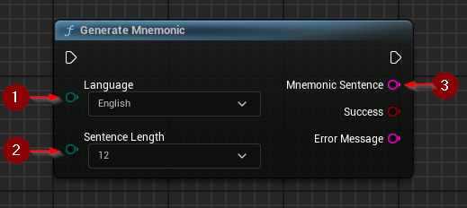
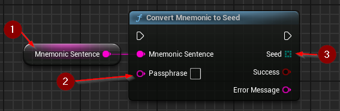

import {Step} from '@site/src/lib/utils.mdx'

Seed that is used in master keypair generation can be generated using mnemonic sentences specified in [BIP-39](https://github.com/bitcoin/bips/blob/master/bip-0039.mediawiki).

:::warning
Mnemonic Sentences, the Seed as well as the optional passphrase should all be kept secret. Knowledge of this data may result
in compromised wallet security.
:::

## Generating a Mnemonic Sentence

`Generate Mnemonic` generates a new mnemonic sentence that can be used for master key seed generation.
This function requires inputs as follows:

* Language <Step text="1"/> : The language to be used.
* Sentence Length <Step text="2"/> : Predefined sentence word length.

If the operation is successful, the value *Mnemonic Sentence* <Step text="2"/> will hold the generated sentence.

## Generating a Seed from Mnemonic Sentence

`Convert Mnemonic to Seed` generates a seed from the provided mnemonic sentence. The result can be used for master key generation.
This function requires inputs as follows:

* Mnemonic Sentence <Step text="1"/> : The sentence that will be converted into a seed.

Optionally additional inputs may be provided:

* Passphrase <Step text="2"/> : An optional passphrase, that secures the key generated from seed. If unused, should be left empty.

