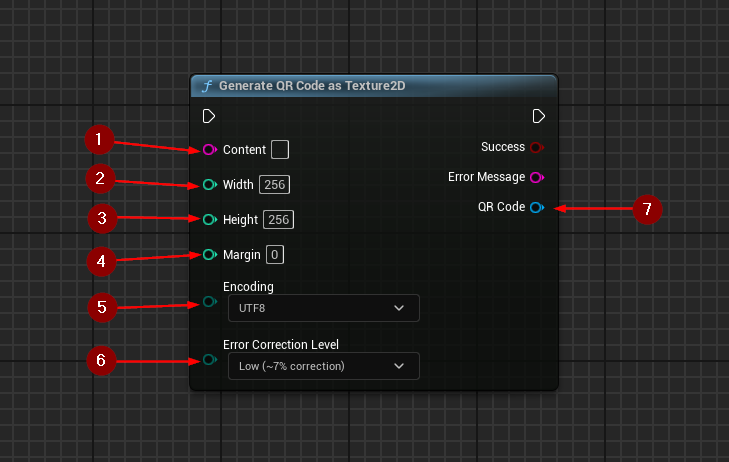
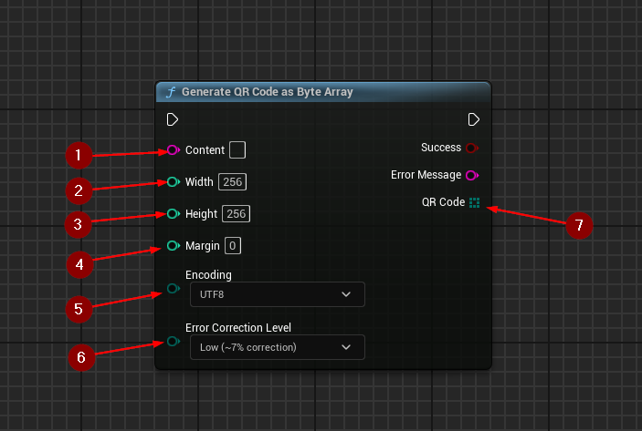
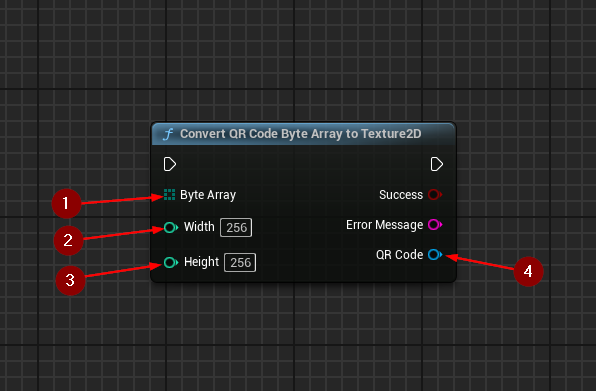

import {Step} from '@site/src/lib/utils.mdx'

[*ZXing-C++ Third Party Library*](https://github.com/zxing-cpp/zxing-cpp) is used in generation of the QR code bit matrix.

## QR Code Generation as Texture2D
`Generate QR Code as Texture2D` generates a QR code from a text string of specified size in pixels as a Texture2D.

This function requires inputs as follows:
* Content <Step text="1"/> : The text to store in the QR code. Must not be empty.
* Width <Step text="2"/> : The width in pixels of the QR code. Must be greater than 0.
* Height <Step text="3"/> : The height in pixels of the QR code. Must be greater than 0.
* Margin <Step text="4"/> : The margin in pixels around the QR code. Must be greater than or equal to 0.
* Encoding <Step text="5"/> : The character set to use for encoding the QR code.
* Error Correction Level <Step text="6"/> : The error correction level, ranging from low (~7%) to high (~30%).
This variable refers to the degree of redundancy built into the code to ensure data integrity even
if the code is damaged or partially obscured. A higher error correction level increases the QR code's resilience
to damage, but it also increases the code's size.

If the generation is successful, the value *QR Code* <Step text="7"/> will return the QR code as a Texture2D
with encoded content in it.

## QR Code Generation as Byte Array
`Generate QR Code as Byte Array` generates a QR code from a text string of specified size in pixels as a byte array.

This function requires inputs as follows:
* Content <Step text="1"/> : The text to store in the QR code. Must not be empty.
* Width <Step text="2"/> : The width in pixels of the QR code. Must be greater than 0.
* Height <Step text="3"/> : The height in pixels of the QR code. Must be greater than 0.
* Margin <Step text="4"/> : The margin in pixels around the QR code. Must be greater than or equal to 0.
* Encoding <Step text="5"/> : The character set to use for encoding the QR code.
* Error Correction Level <Step text="6"/> : The error correction level, ranging from low (~7%) to high (~30%).
This variable refers to the degree of redundancy built into the code to ensure data integrity even
if the code is damaged or partially obscured. A higher error correction level increases the QR code's resilience
to damage, but it also increases the code's size.

If the generation is successful, the value *QR Code* <Step text="7"/> will return the QR code as a byte array
with encoded content in it.

## Conversion of QR Code Byte Array to Texture2D
`Convert QR Code Byte Array to Texture2D` converts a byte array containing a QR code to a Texture2D.

This function requires inputs as follows:
* Byte Array <Step text="1"/> : The byte array with the QR code to convert.
* Width <Step text="2"/> : The width in pixels of the QR code. Must match the original width used during QR code generation.
* Height <Step text="3"/> : The height in pixels of the QR code. Must match the original height used during QR code generation.

If the conversion is successful, the value *QR Code* <Step text="4"/> will return the QR code as a Texture2D
with encoded content in it.