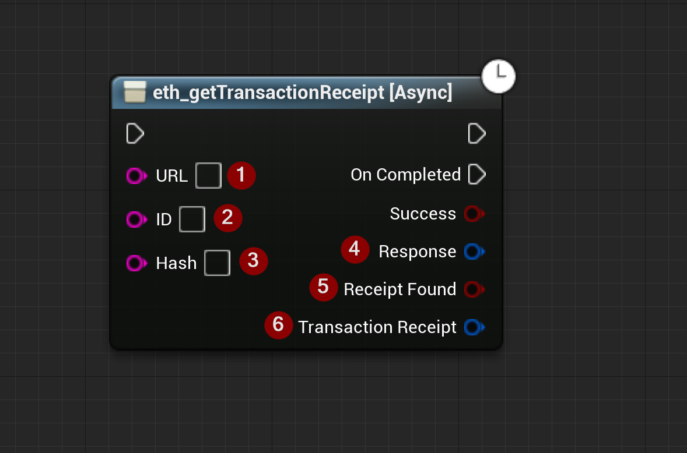

import {Step} from '@site/src/lib/utils.mdx'

## eth_getTransactionReceipt

`eth_getTransactionReceipt` Returns the receipt of a transaction by transaction hash. This function requires input as follows:

* URL <Step text="1"/> : RPC endpoint (Blockchain URL).
* ID <Step text="2"/> : RPC ID(Optional), used when calling multiple asynchronous RPC calls to differentiate your response data from each other.
* Hash <Step text="3"/> : Transaction hash.

The returned *Response* <Step text="4"/> is a struct that holds the JSON- info of the header and body of the response as well as https status code.

:::note
If *Success* is *True* that only means that the response from the *Blockchain* was successful only.

If *Receipt Found* is *True* that only means that the *Response* was successful and the *Transaction Receipt* was found.
:::

If successful, returns the *Transaction Receipt* <Step text="6"/> which contains transaction receipt data of the given hash.