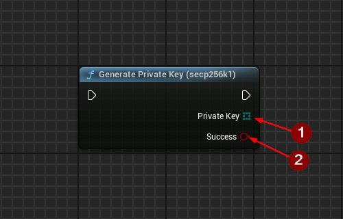
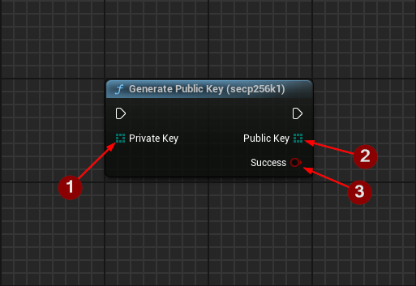
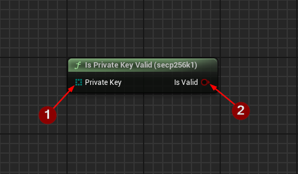
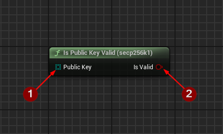
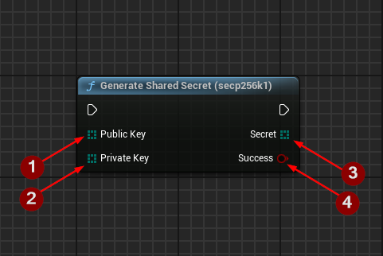
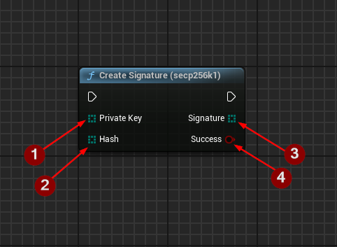
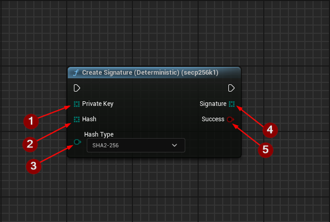
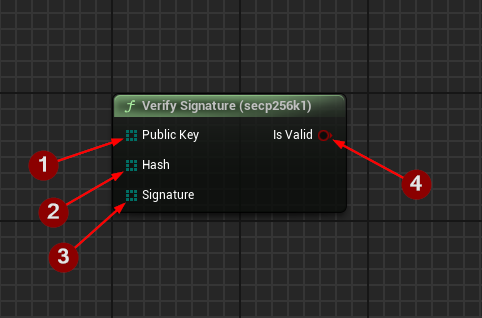
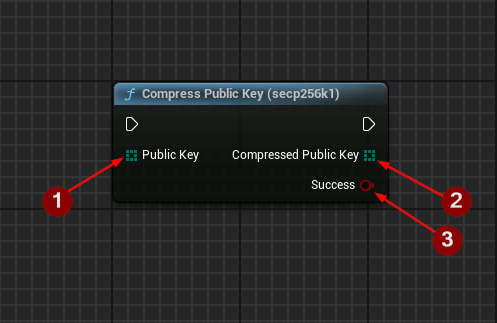
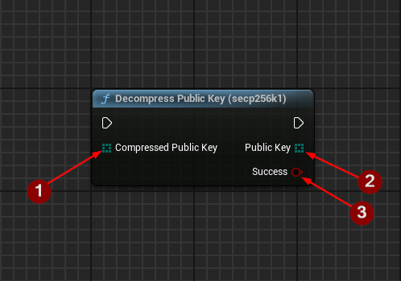

import {Step, Highlight} from '@site/src/lib/utils.mdx'

## What is Secp256k1

`Secp256k1` refers to a specific elliptic curve and set of parameters used in the implementation of the Elliptic
Curve Digital Signature Algorithm (ECDSA). The "SECP" stands for "Standards for Efficient Cryptography," and "256"
indicates the size of the key in bits. The "K1" denotes that this curve is specifically designed for use in cryptography.

The `Secp256k1` elliptic curve is defined over the finite field of prime order. The equation of the curve is: $y^2 = x^3 + 7 \mod p$.

where:
* $p$ is a large prime number (the field modulus),
* $x$ and $y$ are the coordinates of a point on the curve.

`Secp256k1` has gained significant prominence due to its use in various blockchain networks, most notably in Bitcoin and Ethereum.
`Secp256k1` is used for key pair generation, digital signatures, and verification of transactions.
Addresses are derived from public keys generated using this elliptic curve.

The choice of `Secp256k1` for Ethereum was influenced by several factors, including the efficiency of the curve's
arithmetic operations, its resistance to certain types of cryptographic attacks, and its relatively simple mathematical
structure. The properties of `Secp256k1` make it well-suited for the cryptographic requirements of blockchain
applications, providing a good balance between security and computational efficiency.

:::info
For more detailed overview, please follow this [wiki-page](https://en.bitcoin.it/wiki/Secp256k1).
:::

## Available Functions

On this page you will find all the available functions for `Secp256k1` curve implemented in this plugin.

### Generate Private Key
`Generate Private Key (secp256k1)` is a function that allows you to generate a *Private Key* using `secp256k1`.
There is a slight chance of failure on untested platforms, but in general the plugin should work on all platforms.

The function returns the following:
* Private Key <Step text="1"/>: The generated private key.
* Success <Step text="2"/>: A boolean value indicating whether the private key generation was successful or not.

:::info
We strongly recommend using this function for *Private Key* generation since it's using a high secure random byte function.
:::

### Generate Public Key

`Generate Public Key (secp256k1)` is a function that allows you to generate a *Public Key* from a specified *Private Key*
using `secp256k1`.

This function requires the following inputs:
* Private Key <Step text="1"/>: The private key to use for generating the public key.

The function returns the following:
* Public Key <Step text="2"/>: The generated public key.
* Success <Step text="3"/>: A boolean value indicating whether the public key generation was successful or not.

### Is Private Key Valid

`Is Private Key Valid (secp256k1)` is a function that checks if the given *private key* is valid for `Secp256k1`.

This function requires the following inputs:
* Private Key <Step text="1"/>: The private key to validate.

The function returns the following:
* Success <Step text="2"/>:  A boolean value indicating whether the given private key is valid for Secp256k1 or not.

### Is Public Key Valid

`Is Public Key Valid (secp256k1)` is a function that checks if the given *public key* is valid for `Secp256k1`.

This function requires the following inputs:
* Public Key <Step text="1"/>: The public key to validate.

The function returns the following:
* Success <Step text="2"/>:  A boolean value indicating whether the given public key is valid for Secp256k1 or not.

### Generate Shared Secret

`Generate Shared Secret (secp256k1)` is a function that generates a shared secret using `Secp256k1`.
This shared secret is typically derived from your private key and someone's public key to establish a secure
communication channel or to derive additional keys for symmetric encryption.

This function requires the following inputs:
* Public Key <Step text="1"/>: The public key to use for generating the secret.
* Private Key <Step text="2"/>: The private key to use for generating the secret.

The function returns the following:
* Secret <Step text="3"/>:  The generated secret.
* Success <Step text="4"/>:  A boolean value indicating whether the shared secret generation using Secp256k1 was successful or not.

### Create Signature

`Create Signature (secp256k1)` is a function that signs the given hash with the private key using `Secp256k1`.

This function requires the following inputs:
* Private Key <Step text="1"/>: The private key to use for signing.
* Hash <Step text="2"/>: The hashed message to sign.

The function returns the following:
* Signature <Step text="3"/>:  The created signature.
* Success <Step text="4"/>:  A boolean value indicating whether the signing using Secp256k1 was successful or not.

:::info
Requires the given hash to be at least 16 bytes in length. Too short and it will fail. Too long and the overflowing
bytes will be cut off.
:::

### Create Signature Deterministic

`Create Signature (Deterministic) (secp256k1)` is a function that signs the given hash deterministically with the
private key using `Secp256k1`.

This function requires the following inputs:
* Private Key <Step text="1"/>: The private key to use for signing.
* Hash <Step text="2"/>: The hashed message to sign.
* Hash Type <Step text="3"/>: Type of the hash function used in hashing the message.

:::info
`Hash Type` has to match the actual hash function used when hashing the message.
Different hash type will result in an invalid signature.
:::

The function returns the following:
* Signature <Step text="4"/>:  The created signature.
* Success <Step text="5"/>:  A boolean value indicating whether the deterministic signing using Secp256k1 was successful or not.

:::info
Requires the given hash to be at least 16 bytes in length. Too short and it will fail. Too long and the overflowing
bytes will be cut off.
:::

### Verify Signature

`Verify Signature (secp256k1)` is a function that checks if the signature of a signed hash with the provided
*public key* using `Secp256k1` is valid.

This function requires the following inputs:
* Public Key <Step text="1"/>: The signer's public key to use for verifying the given hashed message and signature.
* Hash <Step text="2"/>: The hashed message that was used to create the signature.
* Signature <Step text="3"/>: The signature to verify it matches with the given signer's public key and the hashed message.

The function returns the following:
* Success <Step text="4"/>:  A boolean value indicating whether the signature of a signed hash using Secp256k1 is valid or not.

### Compress Public Key

`Compress Public Key (secp256k1)` is a function that compresses the *public key* using `Secp256k1`.

This function requires the following inputs:
* Public Key <Step text="1"/>: The uncompressed public key.

The function returns the following:
* Compressed Public Key <Step text="2"/>: The compressed public key.
* Success <Step text="3"/>:  A boolean value indicating whether the compression of the public key using Secp256k1 was successful or not.

### Decompress Public Key

`Decompress Public Key (secp256k1)` is a function that decompresses the compressed *public key* using `Secp256k1`.

This function requires the following inputs:
* Compressed Public Key <Step text="1"/>: The compressed public key.

The function returns the following:
* Public Key <Step text="2"/>: The uncompressed public key.
* Success <Step text="3"/>:  A boolean value indicating whether the decompression of the public key using Secp256k1 was successful or not.

:::info
The function might return false if the decompressed *public key* is not valid.
:::

