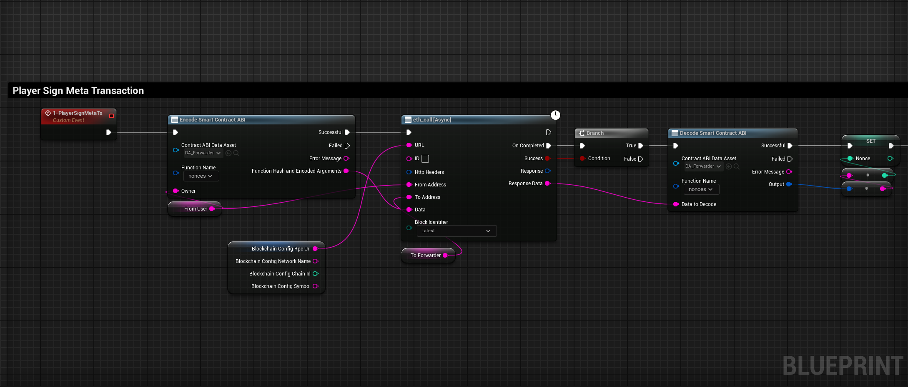
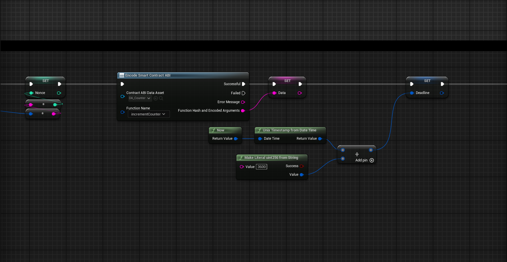
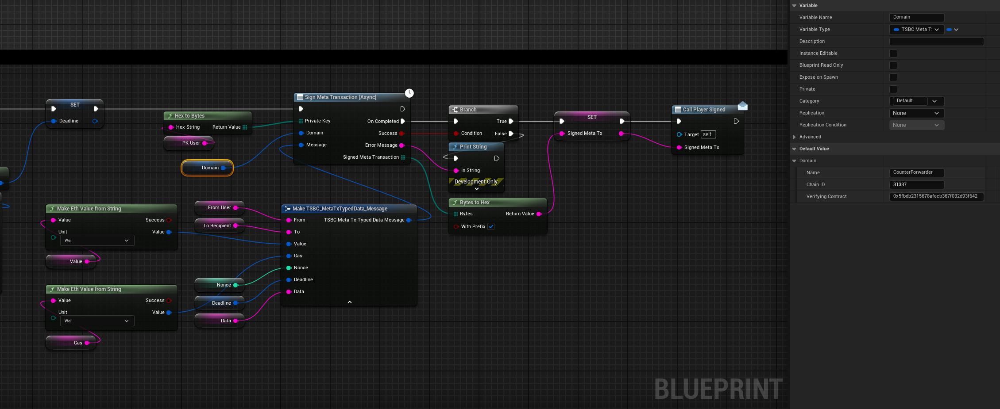
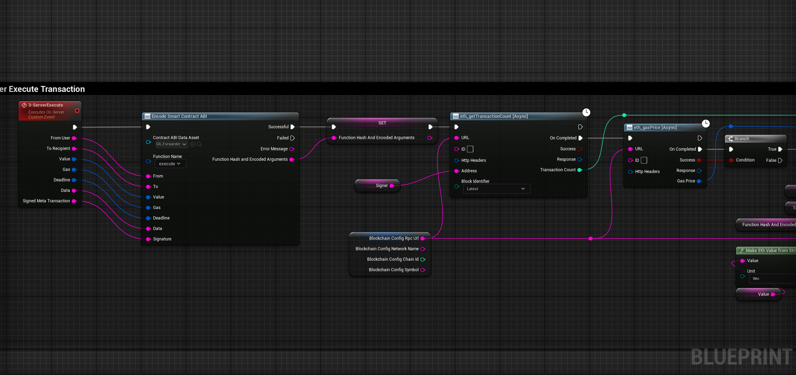
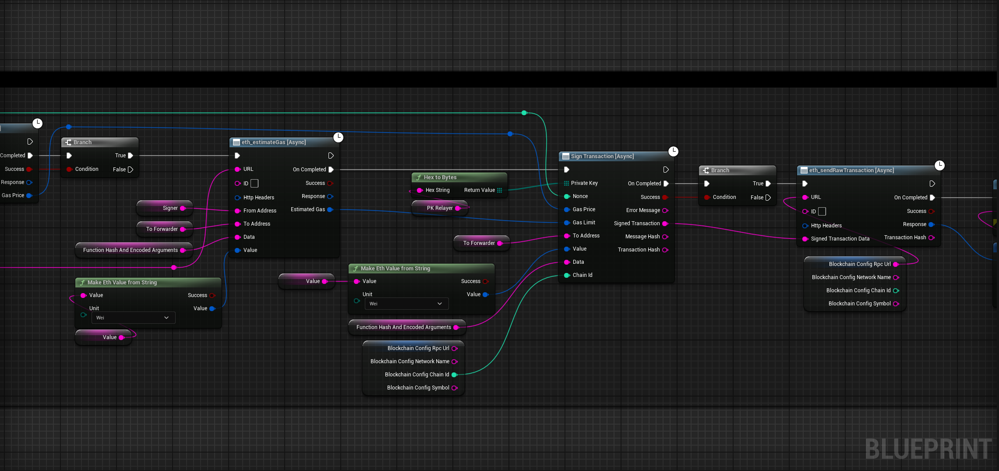

import {Step, Highlight} from '@site/src/lib/utils.mdx'

# Unreal Engine Example
This is an example demonstrating how to make Meta Transactions inside Unreal Engine using this plugin.

## Prepare Meta Transaction Data for the User to Sign

### Nonce
First of all we want to get the user's nonce from the `CounterForwarder` contract that we deployed [earlier](/docs/2.6.0/ethereum/meta-transactions/example/forwarder).

### Data
Save the encoded data of the `incrementCounter` function that we are going to call using a Meta Transaction.

### Deadline

In our case we will set the deadline to the current time plus 1 day from when the user signs the Meta Transaction in Unix Timestamp.

### Private Key
The user's private key that will be used to sign the Meta Transaction.

### Domain

The domain struct should contain:

* Name: The name of the Forwarder that will be processing the transaction, in our case it is
`CounterForwarder`.
* Chain ID: The chain id of the Blockchain that the `CounterForwarder` contract is deployed on.
* Verifying contract: This is the `CounterForwarder` contract address.

### Message

The message struct should contain:

* From : The address of the user that will be signing this message.
* To : The address of the deployed `Counter` contract.
* Value : In our case it is `0` since the `incrementCounter` function is non-payable.
* Gas : The gas limit that will be forwarded, we can set it to `300000`.
* Nonce : The user nonce that we received earlier.
* Deadline : A [Unix Timestamp](/docs/2.6.0/ethereum/meta-transactions/sign-meta-transaction#unix-timestamp) after which the request is not executable anymore, which we calculated earlier.
* Data : The encoded data of the `incrementCounter` function.

## Relayer Execution

In our case we want a dedicated server to execute the Meta Transaction on behalf of a user.

### Prepare Relayer Signing

* The server needs to receive the original Data that was used to create the Signed Meta Transaction.
* First we will encode the data by selecting the `execute` function from the Forwarder contract *ABI*.
* Then, we need to get the *Relayer's* nonce and the current gas price to execute the transaction.

### Relayer Signing and Sending

* After that we can call `estimate gas` function, so we can provide a gas limit to execute this transaction.
* Then we can sign the transaction with the *relayer's* private key and provide all the needed arguments for the
`sign transaction` function.
* Lastly we can send this transaction to the Blockchain and the meta transaction will be executed.

