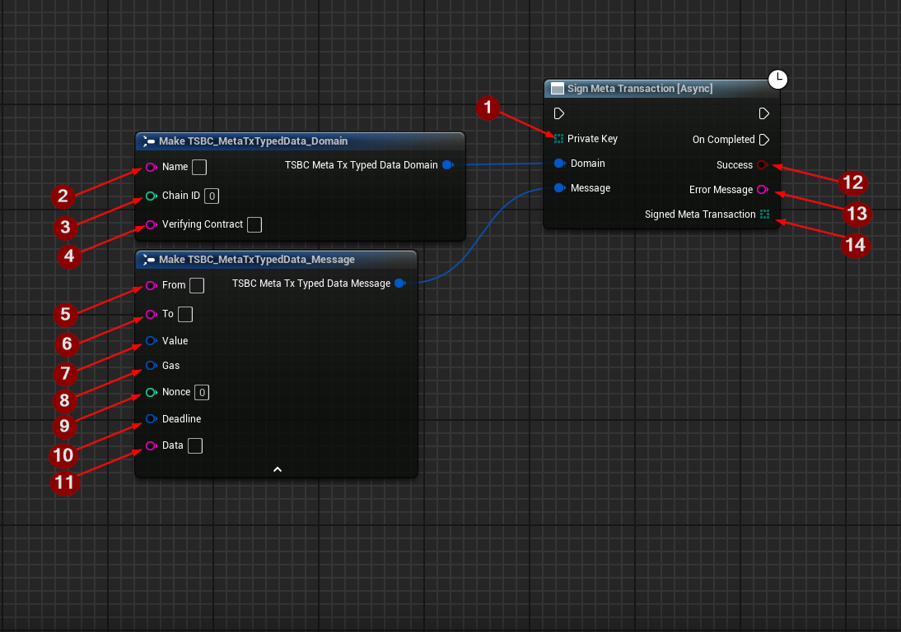
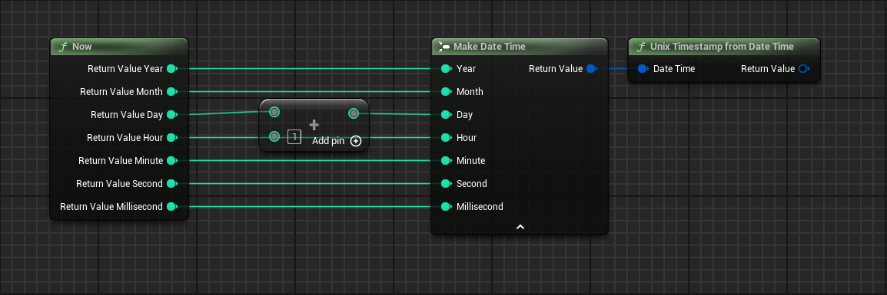

import {Step, Highlight} from '@site/src/lib/utils.mdx'

# Sign Meta Transaction

`Sign Meta Transaction` function signs a meta transaction that is compatible with EIP-712.

This function requires the following inputs:
* `Private Key` <Step text="1"/> The private key to use for signing.
* `Domain` requires the following:
    * Name <Step text="2"/> The domain name provided to the Forwarder contract (EIP-2771) when it was deployed.
    * Chain ID <Step text="3"/> The chain id of the Blockchain.
    * Verifying Contract <Step text="4"/> The Forwarder contract address (EIP-2771) that will verify the transaction.
* `Message` requires the following:
    * From <Step text="5"/> An address to operate on behalf of. It is required to be equal to the request signer.
    * To <Step text="6"/> The address that should be called.
    * Value <Step text="7"/> The amount of native token to attach with the requested call.
    * Gas <Step text="8"/> The amount of gas limit that will be Forwarder with the requested call.
    * Nonce <Step text="9"/> A unique transaction ordering identifier to avoid replayability and request invalidation.
    * Deadline <Step text="10"/> A [Unix Timestamp](/docs/2.6.0/ethereum/meta-transactions/sign-meta-transaction#unix-timestamp) after which the request is not executable anymore.
    * Data <Step text="11"/> Encoded msg.data to send with the requested call.

The function returns the following:
* <Step text="12"/> A boolean value indicating whether the meta transaction signing was successful or not.
* <Step text="13"/> An error message if meta transaction signing fails.
* <Step text="14"/> The signed meta transaction.

## Unix Timestamp

`Unix Timestamp from Date Time` helper function that takes date time struct and converts it to a Unix Timestamp.

This helper function will make it easier for developers to specify a deadline for the Meta Transaction using Unreal
Engine's date time struct.

### Example

