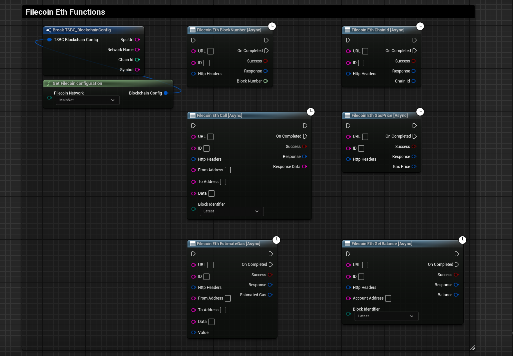
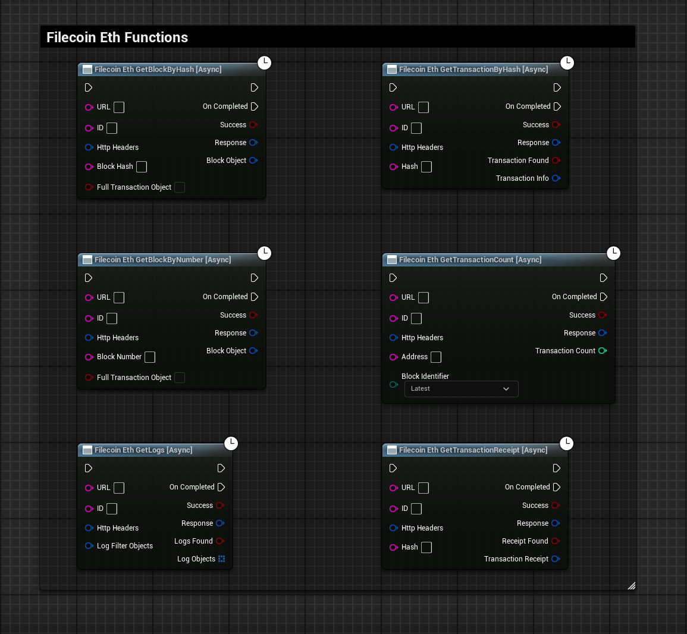
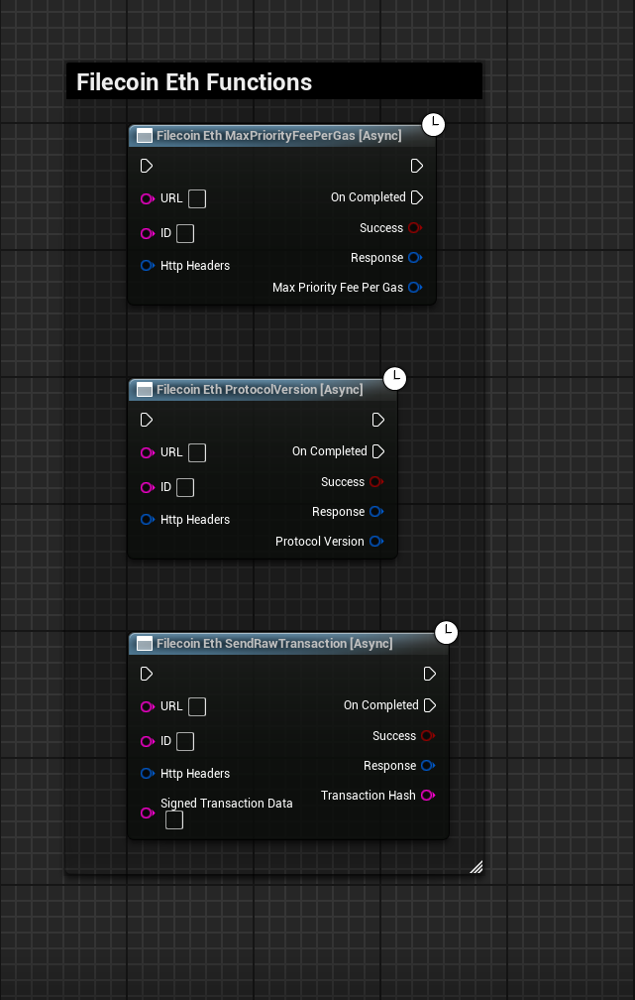

import {Step} from '@site/src/lib/utils.mdx'

## Available Functions

Here are all the currently supported *eth* functions that are executable on `Filecoin` blockchain.

* `Filecoin.EthBlockNumber` 
* `Filecoin.EthCall` 
* `Filecoin.EthChainId` 
* `Filecoin.EthEstimateGas` 
* `Filecoin.EthGasPrice` 
* `Filecoin.EthGetBalance` 

* `Filecoin.EthGetBlockByHash` 
* `Filecoin.EthGetBlockByNumber` 
* `Filecoin.EthGetLogs` 
* `Filecoin.EthGetTransactionByHash` 
* `Filecoin.EthGetTransactionCount` 
* `Filecoin.EthGetTransactionReceipt` 

* `Filecoin.EthMaxPriorityFeePerGas` 
* `Filecoin.EthProtocolVersion` 
* `Filecoin.EthSendRawTransaction` 

:::info
Reference for `Filecoin` documentation [here](https://docs.filecoin.io/reference/json-rpc/eth).
::: 