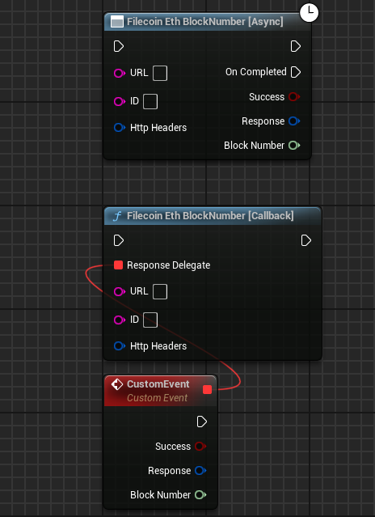

import {Step} from '@site/src/lib/utils.mdx'

## General Functions Implementation 

All *Filecoin* functions that are supported in the plugin have 2 versions of them as shown in the image below.
The first one have a *Response Delegate* as *Call-back*,and the other one have *Response Delegate* as *Async Task*.

*Async* functions works better for use cases where there is no parallel calls. While *Call-backs* works best if you're querying multiple calls at the 
same time and not putting them in queue.

:::note
Both versions take the same input and returns the same output.
::: 