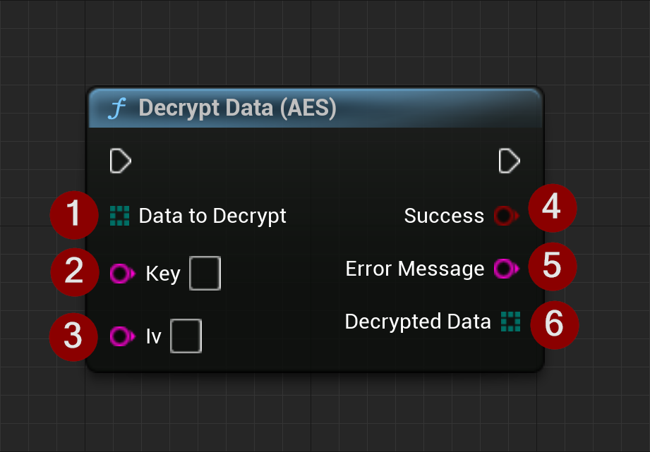

import {Step, Highlight} from '@site/src/lib/utils.mdx'

`Decrypt Data (AES)` function decrypts data using the AES-256 CBC algorithm.
This function is intended to be used to decrypt small amounts of sensitive data such as private keys.

This function requires the following inputs:
* <Step text="1"/> The data to be decrypted.
* <Step text="2"/> The key used to decrypt the data.
* <Step text="3"/> The initial vector used with the key to decrypt the data.

The function returns the following:
* <Step text="4"/> A boolean value indicating whether the decryption was successful or not.
* <Step text="5"/> An error message if decryption fails.
* <Step text="6"/> The decrypted data.

:::warning
This function is specifically designed to decrypt private keys and is not suitable for decrypting large amounts of data.
:::

