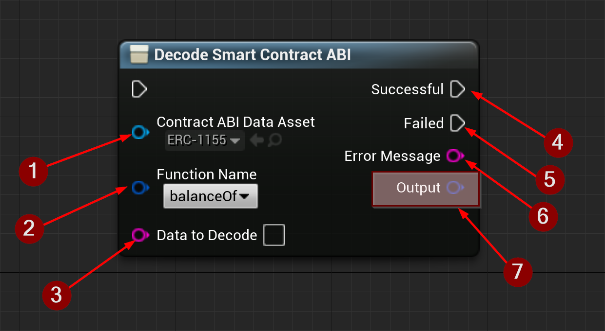
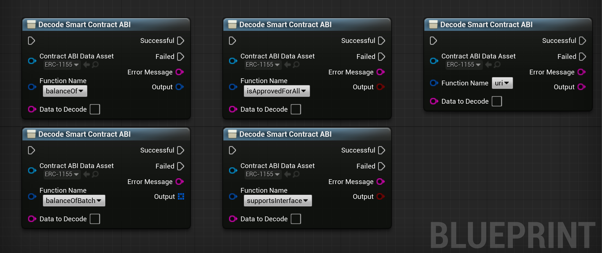

import {Step} from '@site/src/lib/utils.mdx'

The `Decode Smart Contract ABI` node generates a *Function Selector* with argument decoding for a specific function of an *Ethereum Smart Contract*.

* Contract ABI Data Asset <Step text="1"/> : Data asset that holds parsed data for the *Smart Contract ABI*.
* Function Name <Step text="2"/> : The function name to hash.
* Data to Decode <Step text="3"/> : The data to decode.
* Successful <Step text="4"/> : Executes when decoding was successful.
* Failed <Step text="5"/> : Executes when decoding failed.
* Error Message <Step text="6"/> : Contains an error message in case the operation failed. Otherwise, it will be empty.
* Outputs <Step text="7"/> : `Output pins` will be generated dynamically depending on the selected function.

:::info
If the operation was successful, the value in the generated *Output pins* <Step text="7"/> will hold the decoded data returned from an *Ethereum* RPC-call.
:::

## Examples

Here is an example of how the node will look like when selecting different smart contract functions to generate *Output pins*.

Here is an example of how this node will look like when selecting different smart contract functions.
The *output pins* are dynamically generated according to the selected function's signature. This means that
the number of *output pins* and their respective names and data types will be correctly reflected.

:::warning Limitations
Due to limitations in *Blueprints* adding nested arrays to this node was not possible, so a *Smart Contract* function
with a `TupleArray` output type can't be decoded, and a *Smart Contract* function with 1 `Tuple` plus any other
type, can't be decoded also.
:::