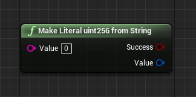
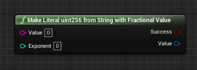
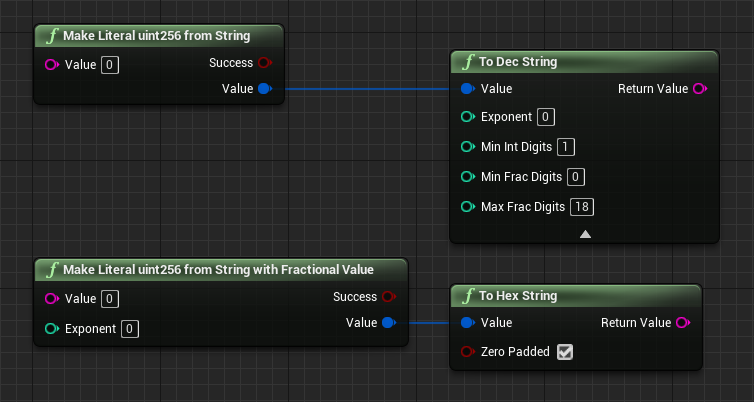
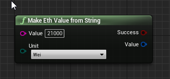
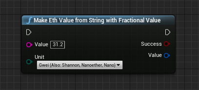
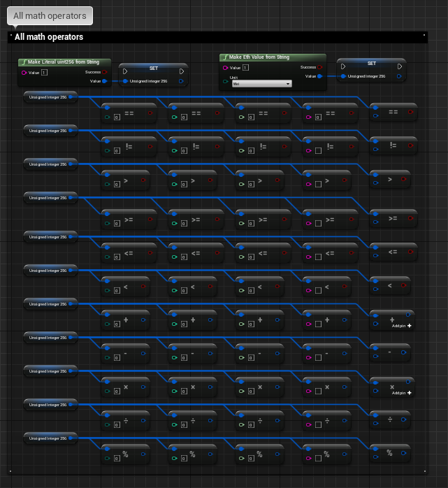
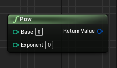

import {Step} from '@site/src/lib/utils.mdx'

## Why Implementing Uint256

`uint256` is a 256 bit unsigned integer (meaning this type can only represent positive integers). 
The size of the value stored in this value type should be less than 256 bits where the maximum value stored is equal to 2^(256-1) which is represented in this
decimal number: `115792089237316195423570985008687907853269984665640564039457584007913129639935`.

It is used by *Ethereum* and many other *Blockchains*, also this type exists in *Solidity* language to store absolute values of currencies and counters. 
Integers (Signed or Non-Signed) are immune to data loss, however they are limited to the operations they are able to do.

A single unit of `uint256` represents the smallest unit in *Ethereum* called `Wei`.

## Generating Uint256
Since `uint256` is not a builtin data type you need helper functions to generate values, there are two available helper functions for now:

First we have `Make Literal uint256 from String`. If the string value is prefixed with "0x" it will be interpreted as a hex value, otherwise as a decimal value.

The Second function is `Make Literal uint256 from String with Fractional Value`. The input string must be a decimal value.
The exponent describes the number of digits to move the decimal point to the left or right. A positive exponent moves the decimal point to the right while a negative exponent moves it to the left.

### Current Support For Uint256
 * Parse value from string:
    * As decimal, if input consists of valid decimal digits (0 to 9)
    * As hexadecimal, if input is prefixed with "0x" and the remaining part consists of valid hex digits (0 to 9, A to F).
 * Convert uint256 value to string:
    * In decimal notation
    * In hexadecimal notation
 * Handle value overflow and underflow

### Generate Eth Value

There are also 2 helper functions with fixed 18 digit exponent (Eth to Wei).

`Make Eth Value from String` Tries to parse the input string value to an *Ethereum* unit stored in an uint256 data type.

`Make Eth Value from String with Fractional Value` This function can handle fractional values as inputs but will eventually truncate the fractional part after applying the unit conversion operation.

## Math Operations And Comparisons

Math operations for `uint256`:
* Addition          (+)
* Subtraction       (-)
* Multiplication    (*)
* Division          (/)
* Modulo            (%)

Math Comparison for `uint256`:
* Equal             (==)
* Unequal           (!=)
* Greater Than      (> )
* Greater or Equal  (>=)
* Less Than         (< )
* Less or Equal     (<=)

Debugging
* If enabled via project settings, human-readable debug values can be calculated for easier debugging purposes. 

## Extra Math Functions
`Pow` returns the result of the *Base* argument raised to the power of the *Exponent* argument stored in uint256 data type.

