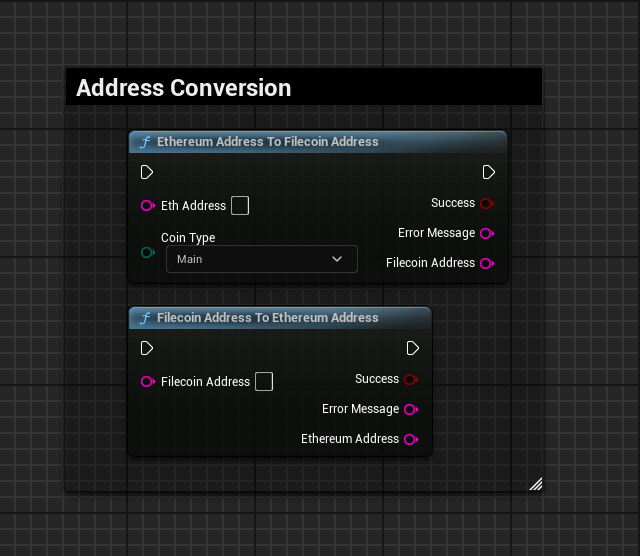
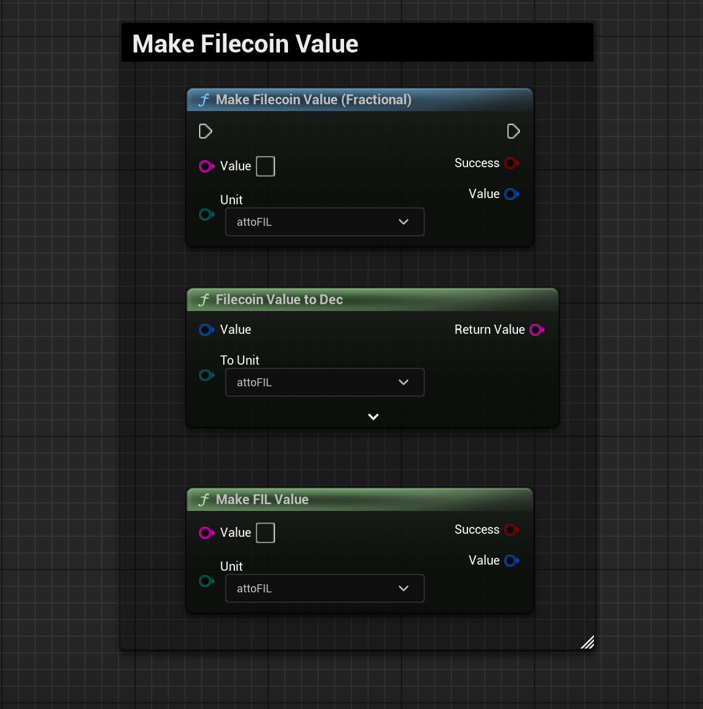

import {Step} from '@site/src/lib/utils.mdx'

## Filecoin Helper Functions

### Address Conversion

Converting an *Ethereum* address to *Filecoin* address or vice versa, can be done using these helper functions below:

:::info
These functions will work only with *f410* filcoin addresses.
:::

### Unit Conversion

Making *Fil* token or converting between units of the *FIL* token can be done using the below functions:

:::info
For more info about *Fil* token denomination, go [here](https://docs.filecoin.io/basics/assets/the-fil-token#denominations).
::: 