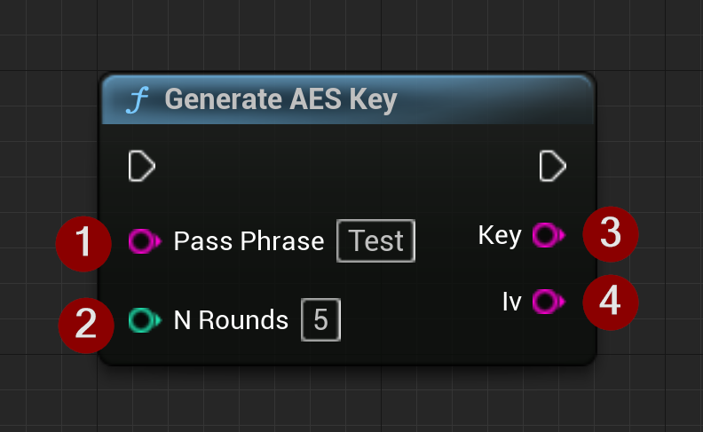

import {Step, Highlight} from '@site/src/lib/utils.mdx'

`Generate AES Key` function is used to generate a 256-bit AES encryption key and an initial vector from a passphrase.
This key can be used to encrypt and decrypt data using the AES encryption algorithm.

This function requires the following inputs:
* <Step text="1"/> The passphrase to generate the key and initial vector from.
* <Step text="2"/> Is the number of times the we hash the material.

The function returns the following:
* <Step text="3"/> The generated AES Key.
* <Step text="4"/> The generated initial vector.

:::warning
If `N Rounds` is set to a high value, the generation of the AES key and initial vector may take a long time and have a
significant performance impact.
:::

