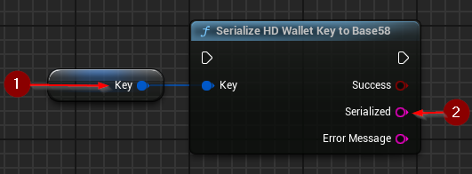
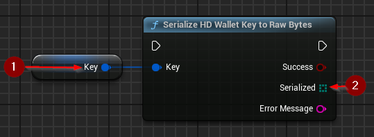

import {Step} from '@site/src/lib/utils.mdx'

## Into Base58

`Serialize HD Wallet Key to Base58` serializes an extended key as specified in [BIP-32](https://github.com/bitcoin/bips/blob/master/bip-0032.mediawiki#serialization-format).
The serialized key is in base58 and starts with characters defined by the standard. The length of a base58 encoded key is up to 112 characters.
This function requires inputs as follows:

* Key <Step text="1"/> : The key to be serialized. Invalid keys will result in an error.

If the operation is successful, the value *Serialized* <Step text="2"/> will hold the serialized and base58 encoded key.

## Into Bytes

`Serialize HD Wallet Key to Raw Bytes` serializes an extended key as specified in [BIP-32](https://github.com/bitcoin/bips/blob/master/bip-0032.mediawiki#serialization-format).
The length of a serialized key is 78 bytes.
This function requires inputs as follows:

* Key <Step text="1"/> : The key to be serialized. Invalid keys will result in an error.

If the operation is successful, the value *Serialized* <Step text="2"/> will hold the serialized key bytes.