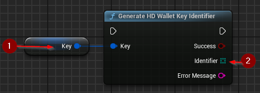

import {Step} from '@site/src/lib/utils.mdx'

## Generating a Key Identifier

`Generate HD Wallet Key Identifier` generates a byte array containing the identifier of an extended key. The identifier
is the Hash160 (RIPEMD160 after SHA256) of the public key data.
This implementation follows [BIP-32](https://github.com/bitcoin/bips/blob/master/bip-0032.mediawiki#key-identifiers) specification.
This function requires inputs as follows:

* Key <Step text="1"/> : The key for which the identifier will be generated. Invalid keys will result in an error.

If the operation is successful, the value *Identifier* <Step text="2"/> will hold the generated identifier bytes.
