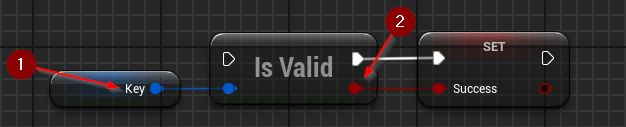
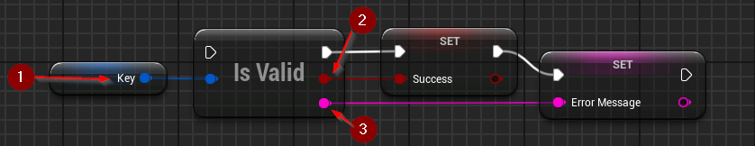

import {Step} from '@site/src/lib/utils.mdx'

## Validating an Extended Key

`Is HD Wallet Key Valid` checks the validity of an extended key.
This function requires inputs as follows:

* Key <Step text="1"/> : The key to be validated.

The value *Success* <Step text="2"/> will be `true` if the key is valid and `false` otherwise.

`Is HD Wallet Key Valid (Error Message)` checks the validity of an extended key and generates an error message if the key is invalid.
This function requires inputs as follows:

* Key <Step text="1"/> : The key to be validated.

The value *Success* <Step text="2"/> will be `true` if the key is valid and `false` otherwise. 
If the key is invalid, the value *Error Message* <Step text="3"/> will contain an error message explaining why the validity check failed.