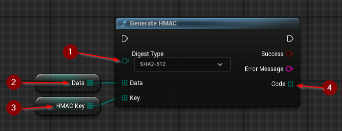

import {Step} from '@site/src/lib/utils.mdx'

## HMAC Generation
`Generate HMAC` generates a [*Hash-based Message Authentication Code*](https://www.rfc-editor.org/rfc/rfc2104.html).
This function requires inputs as follows:

* Digest Type <Step text="1"/> : Type of digest function used in creating the code.
* Data <Step text="2"/> : The data used in creation of the code, first HMAC parameter.
* Key <Step text="3"/> : The key used in creation of the code, second HMAC parameter.

If the operation is successful, the value *Code* <Step text="4"/> will hold the generated HMAC.