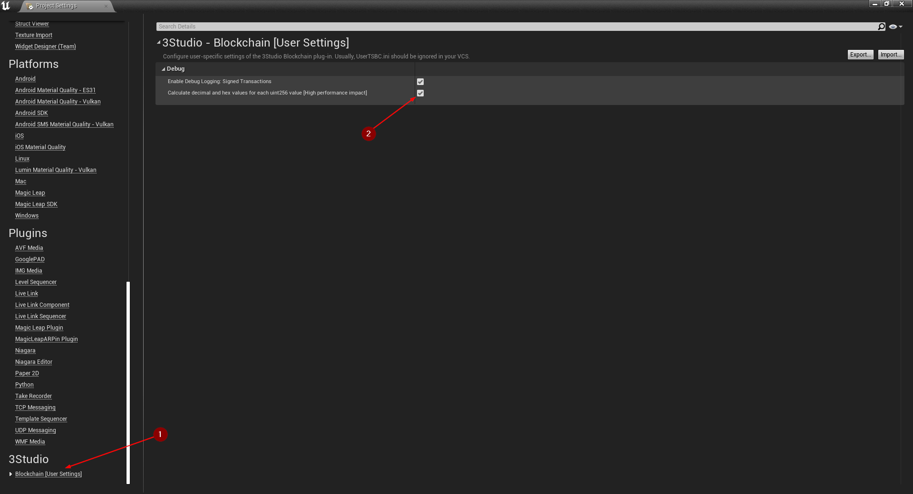
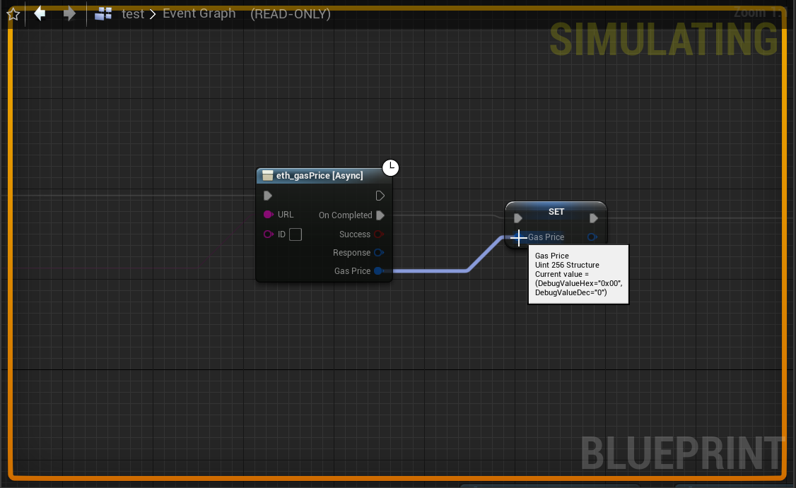

import {Step} from '@site/src/lib/utils.mdx'

## Debugging Transactions

Sometimes it is helpful being able to take a look at the raw data involved in the process of signing a transaction that
shall be sent to the blockchain. This debugging feature can be enabled by going to
`Edit | Project Settings | 3Studio | Blockchain [User Settings]` <Step text="1"/> and then simply activate the option
`Enable Debug Logging: Signed Transactions` <Step text="2"/>.

## Debugging `uint256`

The data type `uint256` provides a debugging feature that can be enabled by going to
`Edit | Project Settings | 3Studio | Blockchain [User Settings]` <Step text="1"/>. Then, activate the option
`Calculate decimal and hex values for each uint256 value [High performance impact]` <Step text="2"/>.

:::note
Please keep in mind that when this debugging feature is enabled it may have a high performance impact.

Also, when packaging with *Build Configuration* set to *Shipping*, this debugging feature is disabled automatically and won't affect performance.
:::

In the two images below you can see that hovering over any `uint256` variable in *Blueprints* debugging mode will
show two values named `DebugValueHex` and `DebugValueDec` in a tooltip.

### Disabled

While this debugging feature is disabled, no debug values will be calculated. Thus, you will
see that the value for both debug variables are just equal to zero.

### Enabled

When this debugging feature is enabled, debug values will be calculated that convert the `uint256` value to hex and
decimal base representations.
Since these conversion are executed **for each variable** of data type `uint256` it may impact runtime performance.
However, it can be a very helpful debugging tool nonetheless.

