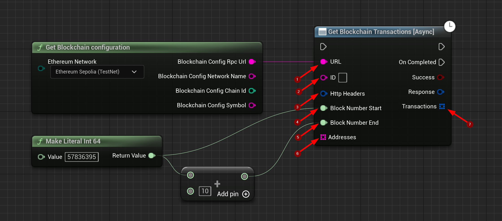

import {Step} from '@site/src/lib/utils.mdx'

## Get Blockchain Transactions

`Get Blockchain Transactions` Gets all Blockchain transactions between a specified range of blocks. This function requires input as follows:

* URL <Step text="1"/> : RPC endpoint (Blockchain URL).
* ID <Step text="2"/> : RPC ID(Optional), used when calling multiple asynchronous RPC calls to differentiate your response data from each other.
* HttpHeaders <Step text="3"/> : (Optional) Additional HTTP headers that will be appended to the request.
* BlockNumberStart <Step text="4"/> : Start of the block number range. Must be less or equal to BlockNumberEnd.
* BlockNumberEnd <Step text="5"/> : End of the block number range. Must be greater or equal to BlockNumberStart.
* Addresses <Step text="6"/> : Transactions will be filtered by any matching address. If empty, no filtering will be applied.

The returned *Response* is a struct that holds the JSON-info of the header and body of the response as well as https status code.

:::note
If *Success* is *True* that only means that the response from the *Blockchain* was successful only.
:::

If successful, returns all *Transactions* <Step text="7"/> between a specified range of blocks.