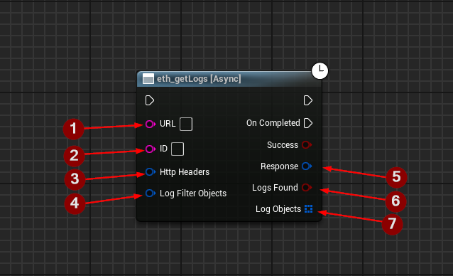

import {Step} from '@site/src/lib/utils.mdx'

## eth_getLogs

`eth_getLogs` Returns an array of all logs that are records of smart contract-generated events on the network and
contain valuable information about transactions and smart contract interactions that match a given filter object.
This function requires input as follows:

* URL <Step text="1"/> : RPC endpoint (Blockchain URL).
* ID <Step text="2"/> : RPC ID(Optional), used when calling multiple asynchronous RPC calls to differentiate your response data from each other.
* HttpHeaders <Step text="3"/> : (Optional) Additional HTTP headers that will be appended to the request.
* LogFilterObjects <Step text="4"/> : The filter parameters to apply.

The returned *Response* <Step text="5"/> is a struct that holds the JSON- info of the header and body of the response as well as https status code.

:::note
If *Success* is *True* that only means that the response from the *Blockchain* was successful only.

If *Logs Found* <Step text="6"/> is *True* that only means that the *Response* was successful and the *Logs Data* was found.
:::

If successful, returns the *Log Objects* array <Step text="7"/> which contains the log objects.