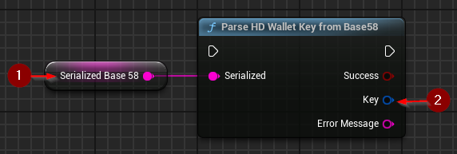
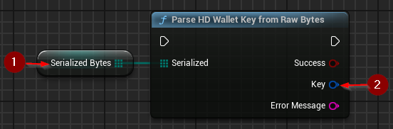

import {Step} from '@site/src/lib/utils.mdx'

## From Base58

`Parse HD Wallet Key from Base58` parses an extended key as specified in [BIP-32](https://github.com/bitcoin/bips/blob/master/bip-0032.mediawiki#serialization-format).
The serialized key is expected to be encoded in base58 and up to 112 characters long.
This function requires inputs as follows:

* Serialized <Step text="1"/> : The serialized key encoded in base58.

If the operation is successful, the value *Key* <Step text="2"/> will hold the parsed valid key.

## From Bytes

`Parse HD Wallet Key from Raw Bytes` parses an extended key as specified in [BIP-32](https://github.com/bitcoin/bips/blob/master/bip-0032.mediawiki#serialization-format).
The length of a serialized key is expected to be 78 bytes.
This function requires inputs as follows:

* Serialized <Step text="1"/> : The serialized key in raw bytes.

If the operation is successful, the value *Key* <Step text="2"/> will hold the parsed valid key.