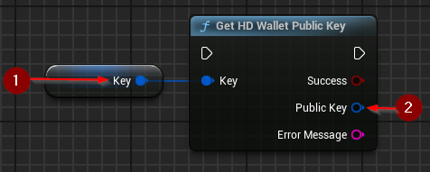

import {Step} from '@site/src/lib/utils.mdx'

## Generating Public Keys from Existing Keys

`Get HD Wallet Public Key` generates a new instance of a public key based on an existing one. Private keys will extract
public key data from private key data and create a new public key instance with corresponding data. Public keys will be copied.
This function requires inputs as follows:

* Key <Step text="1"/> : The key that the result public key will be generated from.

If the operation is successful, the value *Public Key* <Step text="2"/> will hold the generated valid public key.

:::note
This is not a child key derivation (CKD) function. The generated key is on the same depth and
possesses the same child number, and parent fingerprint as the input key.
:::