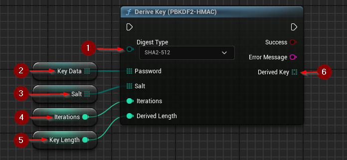

import {Step} from '@site/src/lib/utils.mdx'

[*Password-Based Key Derivation Function 2*](https://www.rfc-editor.org/rfc/rfc2898.html) is used in deriving cryptographic keys.

## Deriving a Key Using PBKDF2-HMAC
`Derive Key (PBKDF2-HMAC)` generates a derived key using the PBKDF2 algorithm, applying [HMAC](https://www.rfc-editor.org/rfc/rfc2104.html)
as its pseudorandom function.
This function requires inputs as follows:

* Digest Type <Step text="1"/> : Type of digest function used in HMAC.
* Password <Step text="2"/> : The password used as master for derived key.
* Salt <Step text="3"/> : The [cryptographic salt](https://en.wikipedia.org/wiki/Salt_(cryptography)).
* Iterations <Step text="4"/> : Number of iterations performed.
* Derived Length <Step text="5"/> : Length of the derived key.

If the operation is successful, the value *Derived Key* <Step text="6"/> will hold the generated key, of specified length.
